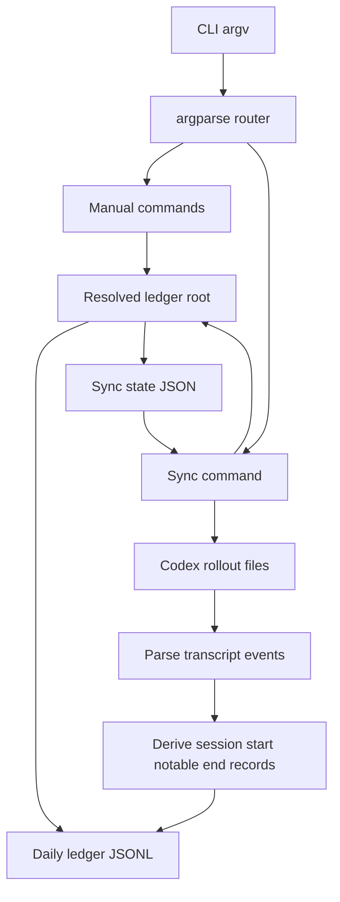

# Architecture Doc: AG Ledger Script

**Last Updated**: 2026-03-17

**Status**: Complete

**Owners**: Kevin Lin / AG Ledger maintainers

**Related**:

- `SKILL.md`
- `scripts/ag-ledger`
- `scripts/tests/test_ag_ledger_integration.py`
- `scripts/integration/test_sync.py`

* * *

## 0. Context

### Purpose

`ag-ledger` is a local CLI that records agent activity into append-only daily JSONL files and can also derive ledger entries from Codex rollout transcripts. The script exists to keep activity tracking durable, queryable, and automation-friendly without requiring edits to historical records or per-workspace `AGENTS.md` mutation.

* * *

## 1. Scope

### In Scope

- Local path resolution for ledger data, Codex session inputs, and sync state (`scripts/ag-ledger`:56-89)
- Manual activity recording via `append`, `append-current`, and `session-id` (`scripts/ag-ledger`:635-682)
- Local ledger querying via `filter` (`scripts/ag-ledger`:685-722)
- Transcript-to-ledger derivation and idempotent sync (`scripts/ag-ledger`:374-632,734-812)
- CLI command routing and public contract definition (`scripts/ag-ledger`:815-941)

### Out of Scope

- Remote storage, shared databases, or network transport
- Conversation capture outside Codex rollout files
- Real-time streaming or file-watcher based ingestion
- Mutation or deletion of existing ledger rows
- Any `AGENTS.md` installation workflow beyond printing migration guidance for deprecated `init` (`scripts/ag-ledger`:725-730)

* * *

## 2. System Boundaries and External Dependencies

### Boundary Definition

The script owns three things:

1. Converting local CLI inputs and environment variables into normalized ledger writes.
2. Translating Codex rollout transcript structure into a smaller activity ledger model.
3. Maintaining just enough sync state to avoid reprocessing unchanged rollout files.

It deliberately delegates transcript production to Codex, notification/automation scheduling to external tooling, and durable storage semantics to the local filesystem.

### External Systems

| Dependency | Purpose | Failure Impact |
| --- | --- | --- |
| Local filesystem | Stores `data/ledger-YYYY-MM-DD.md` and `state/sync-state.json` | Commands cannot persist or read entries |
| `CODEX_THREAD_ID` env var | Supplies current session id for `append-current` and `session-id` | Manual current-session commands fail with exit code 2 |
| `CODEX_HOME` env var or `~/.codex/sessions` | Provides rollout transcript root for `sync` | Sync cannot discover transcripts |
| Codex rollout JSONL schema | Supplies `session_meta`, message timestamps, roles, phases, and content | Sync can skip data or fail per file |
| Local clock / timezone conversion | Determines daily ledger file target and human-readable timestamp | Entries can land in unexpected day buckets if host timezone is wrong |

* * *

## 3. Architecture Overview

### High-Level Diagram (Required)

### Component Responsibilities

| Component | Responsibility | Key Interface |
| --- | --- | --- |
| Path resolution layer | Resolves ledger root, Codex home, session root, and sync state path from CLI args, env vars, and defaults | `resolve_root`, `resolve_codex_home`, `resolve_session_root`, `resolve_state_file` (`scripts/ag-ledger`:56-82) |
| Ledger storage layer | Appends canonical JSON entries and iterates stored rows from daily files | `append_entry`, `iter_entries`, `iter_entries_from_file`, `ledger_path_for_datetime` (`scripts/ag-ledger`:88-227) |
| Manual command layer | Handles user-supplied session ids, current-thread lookups, filtering, and deprecated init output | `cmd_append`, `cmd_append_current`, `cmd_session_id`, `cmd_filter`, `cmd_init` (`scripts/ag-ledger`:635-730) |
| Transcript parser | Converts rollout JSONL into typed `MessageEvent` sequences with local timestamps | `parse_rollout_file`, `extract_message_text`, `parse_event_timestamp` (`scripts/ag-ledger`:237-260,374-436) |
| Turn classifier | Collapses user/assistant event streams into `session_start`, `notable_change`, and `session_end` records | `derive_records_for_rollout`, `finalize_turn`, `build_record`, `is_context_user_message` (`scripts/ag-ledger`:270-372,439-492) |
| Sync engine | Detects changed rollout files, deduplicates by deterministic `source_key`, writes new ledger rows, and persists state | `load_sync_state`, `discover_recent_rollout_files`, `load_source_keys_for_ledger`, `sync_rollout_file`, `cmd_sync` (`scripts/ag-ledger`:503-632,734-812) |
| CLI contract | Declares subcommands, options, aliases, and dispatch | `build_parser`, `main` (`scripts/ag-ledger`:815-941) |

### Primary Flows

1. Manual append flow: parse CLI args, resolve ledger root, use explicit or current session id, write one JSON row, print the stored row.
2. Query flow: parse filters, iterate all daily files, normalize workspace paths when needed, emit matching JSON rows.
3. Sync flow: discover recent rollout files, parse transcript events, derive summarized records, dedupe against both sync state and existing ledgers, append missing rows, then atomically update sync state.

### Primary Request and Data Narrative

The core architectural split is between a thin manual write/query surface and a heavier transcript-sync pipeline. Both paths converge on the same ledger file format, which keeps `filter` simple and makes sync-derived rows indistinguishable from manual rows except for additional `entry_kind` and `source_*` metadata. Sync state is intentionally auxiliary: it speeds up unchanged-file skips, but the ledger files themselves remain the final dedupe backstop when state is stale or reset.

* * *

## 4. Interfaces and Contracts

### Internal Interfaces

- Entry write contract: every persisted row must include `time`, `workspace`, `session`, and `msg`; manual writes may also include `invoked_skill`, `mode`, and `parent_session_id` (`scripts/ag-ledger`:145-183).
- Transcript parsing contract: only `response_item` rows whose payload type is `message` become `MessageEvent`s; missing `session_meta.id` is fatal for that rollout file (`scripts/ag-ledger`:374-436).
- Turn-classification contract:
  - first assistant `commentary` in a turn becomes `session_start`
  - later assistant `commentary` messages in the same turn become `notable_change`
  - assistant `final` or `final_answer` messages become `session_end`
  - `# AGENTS.md instructions` and inline `<skill>` payloads are ignored as user-context noise (`scripts/ag-ledger`:25,270-276,314-372,439-492)
- Deduplication contract: `source_key = {absolute rollout path}:{line_number}:{entry_kind}` must stay deterministic across reruns so both state and ledger scans can suppress duplicates (`scripts/ag-ledger`:279-311,579-632).

### External Interfaces

- CLI surface:
  - `append <session-id> <message...>`
  - `append-current <message...>`
  - `session-id`
  - `filter [--session|--workspace|--invoked-skill|--mode|--parent-session-id|--from|--to]`
  - `sync [--lookback-minutes|--session-root|--state-file]`
  - `init` as a deprecation-only compatibility command (`scripts/ag-ledger`:815-929)
- Storage interface:
  - daily append-only JSONL files at `$META_LEDGER_ROOT/data/ledger-YYYY-MM-DD.md`
  - sync state JSON at `$META_LEDGER_ROOT/state/sync-state.json`
- Input transcript interface:
  - rollout files under `$CODEX_HOME/sessions` or `~/.codex/sessions`
  - uses `session_meta.payload.id`, `session_meta.payload.cwd`, `timestamp`, `payload.role`, `payload.phase`, and message content arrays (`scripts/ag-ledger`:65-75,374-436,739-766)

* * *

## 5. Data and State

### Source of Truth

The authoritative activity history is the set of ledger files under `$META_LEDGER_ROOT/data`. Sync state is not authoritative history; it is a performance cache that helps skip unchanged transcripts and remember already emitted `source_key` values for each rollout file.

### Data Lifecycle

1. Manual commands construct a row from CLI input plus cwd/session metadata and append it directly to the current day ledger (`scripts/ag-ledger`:145-183,635-669).
2. Sync reads recent rollout files, parses transcript events, and derives summarized `DerivedRecord`s keyed to source transcript lines (`scripts/ag-ledger`:374-632).
3. Each derived record is written into the ledger day chosen by the event timestamp, not by sync execution time (`scripts/ag-ledger`:88-89,137-143,602-616). The sync integration test asserts this behavior (`scripts/integration/test_sync.py`:233-254).
4. State is rewritten atomically after each processed rollout file with file fingerprint and emitted source keys (`scripts/ag-ledger`:533-545,621-631).

### Temporal Context Check

| Value | Source of Truth | Representation | Initialization Point | Snapshot / Capture Point | First Consumer | Ordering Result |
| --- | --- | --- | --- | --- | --- | --- |
| Ledger root | CLI `--root`, `META_LEDGER_ROOT`, or default path | Absolute `Path` | `resolve_root` | Before any command logic | All commands | Yes |
| Session id for manual writes | CLI arg or `CODEX_THREAD_ID` | String | `cmd_append` or `resolve_current_codex_session_id` | Before `append_entry` | Ledger write layer | Yes |
| Rollout session/workspace | `session_meta.payload.id` and `cwd` | Strings | `parse_rollout_file` while reading transcript | Stored after `session_meta` row | `derive_records_for_rollout`, `sync_rollout_file` | Yes, otherwise sync fails |
| Event phase | `payload.phase` | Nullable string | `parse_rollout_file` | Stored in `MessageEvent` | Turn classifier | Yes |
| Entry time | Transcript timestamp or current local time | Local `datetime` | `parse_event_timestamp` or `coerce_local_datetime` | Attached to `MessageEvent` / write call | Ledger path selection | Yes |
| Deduplication key | Rollout path + line + entry kind | String | `build_record` | Saved in derived record and ledger row | Sync dedupe checks | Yes |

All critical values are initialized before the consuming context is captured. The only hard-stop case is a rollout without `session_meta.id`, which is rejected before derivation begins.

### Consistency and Invariants

- Ledger rows are append-only; the script never rewrites historical ledger files.
- Manual and sync-derived rows share the same core schema, so `filter` can treat them uniformly.
- `source_key` stability is the main dedupe invariant; if it changes, idempotent sync breaks.
- Sync state can be stale or empty without corrupting history because ledger files are rescanned for existing `source_key` values (`scripts/ag-ledger`:560-576,598-607). The sync integration test covers stale-state recovery (`scripts/integration/test_sync.py`:148-231).
- Workspace filtering accepts either exact stored value or normalized absolute path equivalence (`scripts/ag-ledger`:699-715).

* * *

## 6. Reliability, Failure Modes, and Observability

### Reliability Expectations

This is a local utility, not a long-running service. Reliability is defined as:

- no duplicate sync rows for unchanged transcripts
- deterministic ledger placement by local event time
- predictable exit codes for input and environment failures
- safe sync-state rewrites via atomic replace

### Failure Modes

- Missing `CODEX_THREAD_ID` for current-session commands returns exit code 2 with guidance (`scripts/ag-ledger`:116-125,651-679).
- Invalid `--from` / `--to` values or inverted ranges return exit code 2 (`scripts/ag-ledger`:92-113,688-697).
- Missing session root or malformed sync state stops sync before processing (`scripts/ag-ledger`:739-756).
- Malformed rollout JSON or missing transcript metadata fails the affected rollout file and records it in sync summary while allowing other files to continue (`scripts/ag-ledger`:385-388,409-411,432-433,787-811).
- Concurrent writers are not coordinated with file locks; simultaneous appends could interleave at the filesystem level.
- Lookback-based rollout discovery is mtime-driven, so older transcripts outside the selected window will not sync unless the user widens `--lookback-minutes` (`scripts/ag-ledger`:548-557,916-919).

### Observability

- Metrics: none built in.
- Logs: command errors and warning conditions go to stderr; successful operations print structured JSON to stdout (`scripts/ag-ledger`:203-224,647,669,720,797,809).
- Traces: none.
- Tests:
  - manual command contract coverage in `scripts/tests/test_ag_ledger_integration.py`
  - sync idempotency and timestamp-placement coverage in `scripts/integration/test_sync.py`

* * *

## 7. Security and Compliance

- Authentication and authorization model: none beyond local filesystem permissions and access to Codex transcript directories.
- Sensitive data handling: ledger rows can contain summarized user requests, assistant commentary, workspace paths, and source transcript paths; this data stays on local disk in plaintext JSONL and should be treated as workstation-local sensitive output.
- Compliance or policy constraints: the script is intentionally offline and local-only, which limits external exposure but also means retention and cleanup are the caller's responsibility.

* * *

## 8. Key Decisions and Tradeoffs

| Decision | Chosen Option | Alternatives Considered | Rationale |
| --- | --- | --- | --- |
| Storage model | Append-only daily JSONL files | SQLite, single monolithic log, remote store | Easy to inspect, diff, and append from shell automation |
| Sync idempotency strategy | Deterministic `source_key` plus state-file fingerprints and ledger backstop | State-only dedupe, whole-file hashing only | Allows recovery when state is stale while still skipping unchanged files cheaply |
| Transcript abstraction | Collapse full conversations into `session_start`, `notable_change`, `session_end` | Store every message, use heuristic NLP summarization later | Keeps ledger concise and aligned with agent workflow milestones |
| Timestamp semantics | Use transcript event time or local write time, then bucket by local day | Bucket by sync run time or UTC day | Preserves when work happened from the agent perspective and makes daily ledgers human-readable locally |
| `init` behavior | Compatibility shim that prints migration guidance only | Continue mutating `AGENTS.md` | Keeps architecture focused on automation-first sync instead of repo-local prompt injection |

* * *

## 9. Evolution Plan

### Near-Term Changes

- Split the monolithic script into modules for storage, transcript parsing, and CLI dispatch once behavior stabilizes.
- Add a documented schema/version policy for ledger rows if more structured fields are introduced.
- Expand transcript fixtures to cover more rollout variants, especially partial failures and unusual message content arrays.

### Long-Term Considerations

- Add optional locking or transactional writes if multiple automations or shells start writing the same ledger root concurrently.
- Introduce richer query/report surfaces on top of the current append-only files without changing the storage contract.
- Consider a broader transcript parser boundary if Codex rollout formats evolve beyond the current `response_item` + `message` shape.

* * *

## 10. Risks and Open Questions

### Risks

- Rollout schema drift can silently reduce sync coverage if phases, roles, or content item types change upstream.
- The current no-lock append model is simple but vulnerable to rare concurrent-write corruption or row interleaving.
- Human-readable summaries are truncated and normalized, which is good for scanability but can discard detail needed for later forensics.

### Open Questions

1. Should sync eventually emit richer entry kinds than the current start/notable/end triplet?
2. Is the current `sync-state.json` format stable enough to deserve an explicit migration/versioning policy beyond `SYNC_STATE_VERSION = 1`?
3. Should the script offer a machine-readable schema doc for downstream tools that consume ledger files directly?

* * *

## References

- `scripts/ag-ledger`
- `scripts/tests/test_ag_ledger_integration.py`
- `scripts/integration/test_sync.py`
- `SKILL.md`

## Manual Notes 

[keep this for the user to add notes. do not change between edits]

## Changelog
- 2026-03-17: Created initial architecture doc for the current ag-ledger script implementation. (019cfe68-6e5f-7392-983d-5dc7335e5996)
