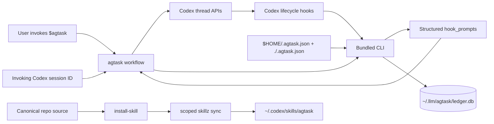
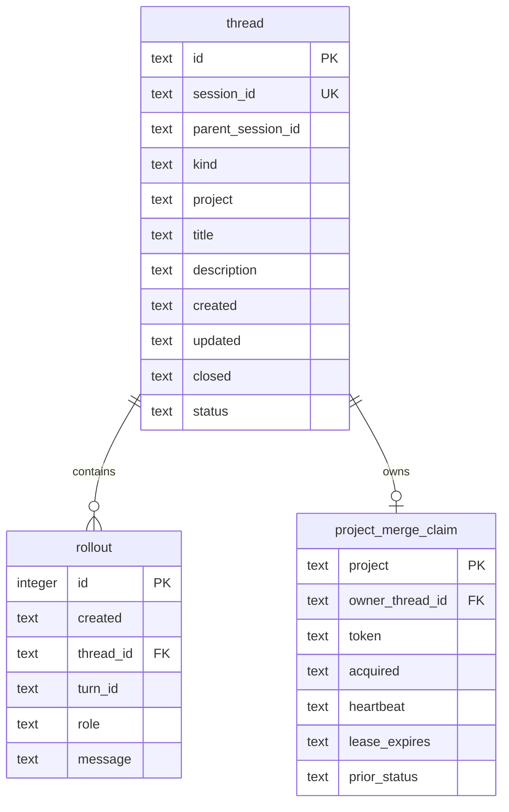

# agtask architecture

`agtask` designates current Codex tasks as main dispatchers, creates child tasks,
and maintains a searchable local projection of their lifecycle. Codex remains
authoritative for conversations; `~/.llm/agtask/ledger.db` stores one
current-state row per tracked thread, including kind and project, plus ordered
summaries of conversation and lifecycle events.

## System boundary

The system has five cooperating parts:

- The [skill workflow](../skills/agtask/SKILL.md) designates the invoking thread
  for main kind or selects clean/fork creation for child kind, resolves
  deterministic kind and project inputs through `resolve-create`, preserves a
  pre-creation logical ID, binds it to the real Codex session ID, and verifies
  tracking.
- The [bundled CLI](../skills/agtask/scripts/agtask) owns schema management, thread state, rollout persistence, command-hook handling and configuration, and layered `.agtask.json` discovery.
- The dashboard command owns a transient, tokenized HTTP server on numeric loopback. It serves an in-memory HTML/CSS/JavaScript shell and fresh ledger snapshots; the browser owns rendering and control state, with one guarded manual-status mutation.
- Codex command hooks map platform lifecycle events into structured rollouts and restore task context on `SessionStart`.
- The Codex orchestration layer consumes structured lifecycle prompt hooks returned by the CLI and decides when and how to deliver them.



The ledger is a purpose-built projection. Full conversation content remains in native Codex rollout JSONL.

## Component ownership

### Skill workflow

The skill owns orchestration that requires Codex app APIs: deriving the task
title and exact initial prompt, resolving the caller ID and CWD, directly
pinning and titling main tasks, creating child threads, composing returned
`OnCreate` data and the resolver's exact bootstrap trailer with child task
prompts, sending child first turns, publishing deep links, and verifying
persisted results. It passes the byte-identical creation prompt as
`--initial-prompt` on initial registration, making that prompt the sole source
of the stable description. It also passes the resolved kind and project on
every registration. Child kind passes the caller session as
`--parent-session-id`,
independent of clean or fork mode.

The direct add route reads the invoking Codex task itself. It pages
`read_thread` to the oldest page with outputs omitted, preserves the current
app title and exact oldest user text, then calls `add <project>`. It never
creates, forks, renames, pins, archives, or messages a task. The CLI generates
the logical UUIDv4 only for an untracked session and otherwise reuses the
session's stored ID for exact reconciliation. Returned `OnCreate` prompt data
is consumed in the invoking task only when the row was newly created.

Main kind is current-thread designation: a resolver-generated logical ID is
bound to the invoking session as an active root dispatcher with null parent
lineage. The skill does
not call create, fork, or follow-up-message APIs for main kind. It publishes a
`designated; tracking pending` link, pins the invoking thread by default,
consumes any returned `OnCreate` prompt in the current agent turn, and applies
the naming-scheme default `⭐ <project>`. Main designation does not synthesize
a bootstrap user rollout; later hooks project subsequent conversation events.

The preferred child creation path is two phase: create an empty child,
immediately publish its link as tracking pending, register it, then send the task
prompt. This lets the first `UserPromptSubmit` hook observe the tracked row.
After prompt acceptance, the caller writes the byte-identical prompt as a
`bootstrap` user rollout without an independent summary. Symmetric
reconciliation makes that write insert, promote, or no-op against the real hook
event.

Successful `add --json`, `register --json`, and `record-turn --json` responses
are the verification snapshots; normal add or creation does not reopen the
ledger or inspect child completion. Ambiguous command outcomes permit bounded
error-path reads and retries. For local and queued child tasks, title and pin
assignment are
deferred through the final bootstrap trailer and run inside the materialized
child. For a remote child with a real Codex session ID (`threadId` in the
creation result), the parent also applies both idempotent actions as a fallback
for a remote host without the hook. Neither path downgrades verified tracking.

### Bundled CLI

The Python-standard-library CLI is the only database writer. Its commands group as follows:

| Responsibility | Commands |
| --- | --- |
| Creation inputs | `resolve-create` |
| Configuration | `config` |
| Schema and queries | `init`, `show`, `list`, `search` |
| Local HTML dashboard and guarded status picker | `dashboard` |
| Thread state | `add`, `register`, `rename`, `status`, `reopen`, `close`, `audit` |
| Rollout writes | `append-rollout`, `record-turn` |
| Codex integration | `hook`, `install-hooks`, `uninstall-hooks` |

Explicit commands fail with actionable errors. The `hook` entrypoint fails open so ledger bookkeeping never interrupts Codex work.

### Rename boundary

Current-task rename crosses the Codex app and SQLite ownership boundary. The
skill requests a read-only CLI plan containing the exact app action and a
deterministic token bound to logical ID, session ID, current title, and
requested title. It executes that app action first, then calls
`rename --apply` with the token. Apply recomputes the token under
`BEGIN IMMEDIATE`; unrelated rollout activity does not invalidate the plan,
while a competing title change or invalid new title does not write. A real
ledger change atomically updates `title` and `updated`, appends one rename
event, and refreshes FTS.

When the ledger command fails after the app action, orchestration re-reads the
row and restores the app to the ledger's current title. This current-row
compensation avoids overwriting a concurrent successful rename; the original
title is only a fallback when the row cannot be read. Failed compensation is
reported as explicit divergence because the two stores cannot share a
transaction.

### Archive audit boundary

Archive audit is a three-phase protocol across the component boundary. First,
the CLI selects only `status = 'active'` rows and emits Codex lookup requests
keyed by `session_id`. The skill workflow performs exact per-session Codex app
reads and returns one strict observation per successful, missing, or failed
lookup. The CLI treats only `state = 'archived'` as an affected row; absence,
missing sessions, partial host failure, and every malformed observation fail
closed or remain explicitly unresolved.

Planning is read-only and returns the full affected task snapshots plus a
SHA-256 plan token derived from the complete active snapshot's logical IDs,
real session IDs, ledger `updated` values, and lookup states. Orchestration
shows the affected set and obtains explicit
user confirmation, refreshes every Codex lookup, then attempts apply with the
fresh observations. Confirmed apply starts `BEGIN IMMEDIATE`, rebuilds the plan,
and compares the supplied token before any write. This prevents a user
confirmation for one candidate snapshot from being reused after ledger state
or Codex archive observations change.

Apply maps the external Codex `archived` fact into the existing terminal ledger
state `done`; it does not add a second terminal state or persist Codex UI
metadata. Each transition sets `closed`, appends `status:active->done`, and
records `archival:codex-thread-archived`. It intentionally bypasses the project
merge lease and close prompt hooks because the Codex thread is already
archived. Once applied, the row is no longer in the active discovery set, so
re-running the same audit is a no-op.

### Dashboard boundary

`dashboard` has a grouped view-model layer shared by browser and JSON modes. It
selects logical `id`, `session_id`, `parent_session_id`, `project`, `title`,
`created`, `updated`, `closed`, and `status`, then derives unfiltered facets, applies exact
multi-value filters and case-folded title search, sorts deterministically
inside fixed lifecycle groups, and closes the connection. A separate point
session-ID lookup supplies the task-detail page with logical `id`, `session_id`,
`parent_session_id`, `title`, `description`,
`created`, and `updated`, plus `created`, `role`, and `message` for rollouts in
reverse chronological `(created, id)` order.

The browser represents each active filter dimension as one segmented chip and
uses one registry-driven dropdown for field and value selection. Values within
a chip are ORed by the existing API contract; field chips and title search are
ANDed. The toolbar trigger and filter-bar plus button open the same menu, and
chip removal immediately requests a new snapshot. Hovering a row and pressing
`s` opens a modal picker for the three manual states. Selection sends both the
rendered expected status and requested status, then reloads the snapshot rather
than moving rows optimistically.

In the default mode, the command validates one snapshot before binding
`127.0.0.1` on an ephemeral port. A fresh 256-bit token scopes the dashboard
and task-detail HTML, CSS, JavaScript, and JSON routes. The URL is flushed before
the browser launch; the server remains in the foreground until interrupt. Each
API request opens a new validated ledger connection, while all static assets
remain in memory. Host, token, route, method, media type, no-store, referrer,
nosniff, and CSP checks form the HTTP boundary, and access logging is disabled
so tokens and filters do not reach stderr. Status mutation additionally
requires the exact loopback origin and JSON media type. Its immediate
transaction compares the expected status before reusing the CLI's manual
transition helper; stale, done, and merging states fail without writes.

`dashboard --json` bypasses both server and browser and emits the same grouped
snapshot once. `--no-open` retains the server but skips browser launch. Browser
task data arrives only as JSON and is inserted into the DOM with text nodes.
Every task row is pointer-clickable while retaining native table semantics;
clicking outside its title opens the token-scoped
`tasks/~<encoded-session-id>` page, while the keyboard-accessible title remains
an encoded `codex://threads/<session-id>` deep link. The non-dot marker prevents
browser path normalization for legal `.` and `..` IDs. The detail page fetches
the matching point-detail API and renders the description, newest-first
timeline, and created and updated properties. Its session-ID property is also
an encoded Codex deep link. There are no external assets or background polling.
All dashboard reads remain read-only. The status endpoint is the only mutation
surface, and it permits only Todo, Active, and Blocked; merge claims,
finalization, and reopen remain workflow-owned.

### Layered configuration and prompt hooks

Every invocation discovers `$HOME/.agtask.json` as the user base and
`./.agtask.json` as the current-project overlay. Objects merge recursively;
project values replace home values at conflicts. Creation inputs resolve in
this order: built-ins, merged configuration defaults, explicit CLI flags.
`config --json` exposes the merged document, loaded sources, and low-to-high
precedence paths.

On first `init`, the CLI atomically creates the missing home configuration with
mode `0600` and the bundled Git-finalization workflow as `OnPreClose`. It never
overwrites an existing home configuration.

`OnCreate`, `OnPreClose`, and `OnPostClose` are prompt-data boundaries, not CLI callbacks.
`resolve-create` exposes the pending `OnCreate` prompt so orchestration can
compose a child task's initial input or consume it in the current agent turn for
main designation; the first successful `register` confirms it.
`close --prepare` atomically acquires or renews the exact-project merge claim,
projects its owner as `merging`, and then returns any enabled `OnPreClose`
prompt. A contended preparation leaves the ledger unchanged and returns a
jittered retry hint. Preparation is repeatable for retry. The committing close
must present the live merge token, transition `merging` to `done`, commit
first, and then returns `OnPostClose`; a repeated committing close returns no
prompt, while reopen followed by close is a new lifecycle. Each returned `hook_prompts` entry
contains the event, prompt, and winning source path. Empty prompts are disabled.
Prompt text is neither executed nor persisted by the CLI.

### Installation layer

The source installer registers this repository's `skills` directory in `~/skillz.json`, runs a scoped `skillz sync --only agtask`, checks unrelated runtime skill trees for changes, and verifies the generated runtime against canonical source byte-for-byte.

The hook installer structurally merges four owned command groups into `~/.codex/hooks.json`. It preserves unrelated groups and file mode, detects concurrent edits, creates a timestamped backup, fsyncs, and atomically replaces the file. Codex users approve the installed handlers through `/hooks`.

## SQLite model

The canonical schema is version 5.



`thread.id` is a canonical UUIDv4 generated before creation and identifies the
logical creation attempt. `thread.session_id` is the unique real Codex session
bound to it. `kind` distinguishes root-dispatching `main` threads from
dispatched `child` threads, and `project` records the resolved project label.
`parent_session_id` is null for main kind and records the invoking Codex session
for child kind, without a foreign key because the parent may not itself be
tracked. Kind, project, parent lineage, initial title, and the
initial-prompt-derived description are immutable during pair reconciliation.
Status is `todo`, `active`, `blocked`, `merging`, or `done`; a check constraint
couples `done` to a non-null `closed` timestamp. `project_merge_claim` remains
owned by logical `thread.id`, and a partial unique index defensively permits
only one `merging` thread per project.

`rollout` contains explicit event identity and presentation data:

- `turn_id` is the stable event identity supplied by Codex or generated for a lifecycle transition.
- `role` is `user`, `assistant`, or `meta`.
- `message` is a normalized, single-line summary capped at 240 Unicode code points.

Role-aware unique indexes enforce one user or assistant row per `(thread_id, role, turn_id)` and one meta row per `(thread_id, turn_id)`. Ordered reads use `(thread_id, created, id)`. FTS5 indexes thread title and description through standard insert, delete, and update triggers. Application transactions write all lifecycle rollouts.

### Event identities

| Event | `role` | `turn_id` | `message` |
| --- | --- | --- | --- |
| Registration | `meta` | `thread.created` | `thread.created` |
| User turn | `user` | Codex turn ID | normalized user summary |
| Assistant result | `assistant` | Codex turn ID | normalized final-result summary |
| Status change | `meta` | fresh opaque ID | `status:<old>-><new>` |
| Title rename | `meta` | fresh opaque ID | `title:renamed` |
| Compaction | `meta` | `compact:<codex-turn-id>:<manual-or-auto>` | `compaction:<manual-or-auto>` |
| Finalization | `meta` | fresh opaque ID | `finalization:completed` |

For a unique event key, replaying the same normalized message is a no-op and a different message is a conflict. State-changing read/check/write sequences use `BEGIN IMMEDIATE`, which serializes concurrent retries. Same-state status and close commands leave timestamps and rollouts unchanged. Reopen followed by close produces new transition and finalization events.

### Bootstrap reconciliation

`bootstrap` is the reserved turn ID for initial-prompt race repair. Registration
first derives the stable description from `--initial-prompt`; an optional
`--description` must normalize identically or registration fails. The skill
supplies the byte-identical prompt to `record-turn` without `--summary`, so the
explicit write and hook use the same normalizer. Reconciliation works in either
arrival order:

1. An exact real event replay returns without mutation.
2. A matching same-role bootstrap is promoted to the real turn ID when it is the only candidate and ordering remains valid.
3. A real event that precedes the bootstrap causes the matching bootstrap write to become a no-op.
4. A bootstrap prompt incompatible with the registered description is rejected;
   later distinct user messages remain separate rollouts.

This keeps message text display-oriented while event keys provide idempotency.

### Creation bootstrap protocol

`resolve-create` returns both typed `bootstrap_args` and a canonical final
`bootstrap_trailer`. Version 1 remains the action-only `pin: bool` plus
one-line `title: str` envelope. Child creation emits version 2, which also
requires a canonical UUIDv4 creation `id` plus nonempty `parent_session_id` and
`project` strings. Each resolver call creates a new ID; orchestration reuses it
for the whole creation attempt.
Validation requires the envelope to be final, the JSON to be canonical and
duplicate-free, every key to exist in the typed handler registry, and every
value's exact Python type to match. The hook does not evaluate input, dispatch
commands, or provide a fallback for unknown keys.

When Codex delegation transport entity-escapes nested content, the parser
decodes exactly one XML entity layer only inside a valid
`<codex_delegation>` wrapper. That restores the transported task body and
bootstrap JSON while preserving a task's literal entities after their outer
transport layer is removed. Canonical JSON and final-position checks then run
against the recovered prompt.

Codex runs pending `SessionStart` hooks before prompt-submit hooks, but the
actual `SessionStart` command input contains only session metadata and source.
The following `UserPromptSubmit` input contains the prompt, real `session_id`,
and `turn_id`, so it is the first reliable parsing boundary. Bootstrap parsing
runs before ledger lookup. A valid version-2 payload initializes the ledger if
needed, registers the hook's own real session ID as an active child, appends
`thread.created`, and records the real user turn under the logical ID in one
transaction. The transaction inserts only when both identities are unclaimed;
the exact `(id, session_id)` pair reconciles idempotently, while an ID owned by
another session or a session owned by another ID produces no writes, context,
or app actions. This rejects a copied title-generation bootstrap after the real
child binds the ID. This lets
a queued worktree self-register after materialization. The adapter decodes only
one complete entity-escaped `<input>` layer inside Codex delegation transport,
including task and JSON values, and serializes concurrent first-ledger schema
initialization. Version-2 app actions are emitted only after that transaction
commits.

The deterministic hook only validates the envelope, strips it from summary
input, and renders allowlisted model context through the structured
`hookSpecificOutput.additionalContext` field. For `pin=true`, that context tells
the child model to invoke `codex_app__set_thread_pinned` on its own session ID.
The title handler independently tells it to invoke
`codex_app__set_thread_title` with the resolved title treated only as tool data.
Those Codex app calls are explicitly model-mediated; they are not shell
execution by the hook. Setting pinned state to true or the same title is
idempotent. The child reports success, tool unavailability, or the exact app
error for each action and continues the actual task. Malformed envelopes and
action failures fail open.

Hook registration remains first-writer-wins because a hook cannot distinguish
the primary child from an internal session submitting a copied bootstrap. For
one-shot creation, the parent treats the session returned by `create_thread` as
authoritative. `register --authoritative-session` may replace an earlier
provisional helper binding only after validating immutable creation metadata,
an unclaimed requested session, and a first-turn-only rollout shape. It removes
helper user/assistant rollouts and reports the displaced session. Titles,
timing, and UUID ordering are never used to choose the canonical session.

Remote creation adds a parent-side reliability path. When the selected or
returned host is non-local and creation returns a real Codex session ID
(`threadId` in the creation result), the caller directly applies the resolved
title and requested pin state through the Codex app before returning. This does
not replace or suppress the child hook; the actions may safely converge because
both setters are idempotent. Queued client/worktree IDs cannot use the fallback
because they are not real Codex session IDs.

## Hook boundary mapping

Codex hook JSON uses `session_id`; the adapter resolves that column to logical
`thread.id` before writing rollout or lifecycle state. `SessionStart`, app
action `threadId`, creation responses, and `$SESSION_ID` remain external
platform vocabulary and always use the Codex session ID.

| Codex event | Ledger effect | Context output |
| --- | --- | --- |
| `UserPromptSubmit` | Validate final bootstrap metadata; version 2 may atomically bind an untracked logical ID to the payload session before recording the real user rollout under that logical ID. Preserve description; ordinarily activate a non-done, non-merging row unless bootstrap repair preserves a later assistant state. While merging, keep the visible status and update only the claim's underlying state; done remains terminal. | Allowlisted bootstrap action request plus current title, status, stable description, five recent rollouts, result contract after an exact-pair successful write; conflicting/copied bindings are silent |
| `Stop` | Record assistant rollout without replacing the description; exact leading `Blocked:` ordinarily transitions to `blocked`, other final results to `active`. While merging, keep the visible status and update only the claim's underlying state; done remains terminal. | None |
| `PostCompact` | Record deterministic `meta` compaction rollout | None |
| `SessionStart` | Read the tracked thread and recent rollouts; never parse bootstrap metadata because the payload has no prompt | Current title, status, stable description, five recent rollouts, result contract |

Hooks are silent for missing ledgers and untracked sessions except when an exact
version-2 creation prompt initializes the ledger and registers its own real
session binding. A `done` thread remains terminal for ordinary turn hooks until
`reopen` explicitly returns it to `active`.

## Core flows

Detailed runtime traces live in the [flow index](flows/README.md). The diagrams
below retain the architecture-level lifecycle summary.

### Clean creation

```mermaid
sequenceDiagram
    participant U as User
    participant A as Calling agent
    participant C as Codex thread service
    participant Q as agtask CLI
    participant D as SQLite
    participant H as UserPromptSubmit hook

    A->>Q: resolve-create; generate logical ID
    A->>C: Start empty clean thread
    C-->>A: Real child session ID
    A-->>U: Link (created; tracking pending)
    A->>Q: register --id/--session-id, initial prompt, kind/project, parent session
    Q->>D: Insert thread and thread.created rollout
    Q-->>A: Post-commit thread JSON
    A->>C: Send Task prompt
    C->>H: UserPromptSubmit(session_id, turn_id)
    H->>D: Record user rollout and activate
    H-->>C: Inject tracked context and validated title/pin actions
    C->>C: Apply title and pin to its own session
    A->>Q: record-turn bootstrap with identical prompt
    Q->>D: Insert, promote, or no-op
    Q-->>A: Active thread JSON with one user rollout
    A-->>U: Final link with verified state
```

When the local app exposes only one-shot clean creation, the child begins its
first turn before parent registration. Its valid version-2 hook can bind the
resolver ID to a session and record the first turn. The caller then publishes
the pending link and registers the returned session with
`--authoritative-session`, the same logical ID, parent session, and exact
creation prompt. It records the byte-identical prompt as an idempotent
`bootstrap` fallback. Hook-first, parent-first, and bootstrap-first orderings
converge to one creation row and one real-ID user rollout. If an internal copied
prompt bound the ID first, authoritative reconciliation rebinds the row and
discards that helper's rollouts before the bootstrap write. The `Stop` hook
remains the sole normal-path assistant writer for the canonical session.

### Fork creation

Fork mode preserves copied context while using the caller's CWD. The caller
forks without a prompt, publishes the pending session link, registers the
resolver ID and real session as `todo` with resolved kind/project and
kind-appropriate session lineage, sends the guarded task prompt, and writes the
byte-identical bootstrap prompt. It validates the write response, applies the
parent title/pin fallback when the child is remote and has a real Codex session
ID, and returns the verified session link without waiting for child-owned title
or pin actions.

### Turns and status

```mermaid
stateDiagram-v2
    [*] --> todo: register before first prompt
    [*] --> active: active registration or v2 first prompt
    todo --> active: first user turn
    active --> blocked: assistant starts with Blocked:
    blocked --> active: user turn or non-blocked result
    todo --> merging: close --prepare claims project
    active --> merging: close --prepare claims project
    blocked --> merging: close --prepare claims project
    merging --> todo: cancel or stale takeover restores prior state
    merging --> active: cancel or stale takeover restores prior state
    merging --> blocked: cancel or stale takeover restores prior state
    merging --> done: close --merge-token
    active --> done: confirmed audit of archived Codex thread
    done --> active: reopen
```

Every actual transition and successful tokenized close is recorded in the same
transaction as current-state mutation. A normal tracked close reaches `done`
only from `merging` with the live fencing token returned by `close --prepare`;
archive reconciliation is the narrow exception and requires an unchanged
confirmed audit plan for a still-active row. Repeating the current state is a
no-op.

### Compaction and restoration

`PostCompact` writes one deterministic meta rollout using the Codex turn ID and manual/auto trigger. The following `SessionStart` reads the thread plus five newest rollouts ordered by `created DESC, id DESC` and renders role with human message. Database row IDs remain internal.

### Pre-close and post-close orchestration

An authorized orchestrator prepares a tracked thread with:

```bash
python3 "$AGTASK_CLI" close --session-id "$SESSION_ID" --if-tracked --prepare --json
```

Preparation with `close --prepare` atomically claims the exact project or
returns a randomized waiting hint with no prompt. A claim transitions the task
to `merging` and returns an opaque fencing token. Heartbeat renews that token;
turn hooks retain the visible projection while updating its underlying state;
cancel restores that latest state, including after expiry while the token still
matches; stale takeover restores the expired owner
before installing a new token. A tracked committing close requires the live
token, sets `status=done`, sets `closed` and `updated` to the same UTC timestamp,
and writes `status:merging->done` plus `finalization:completed` meta rollouts
with fresh event IDs before deleting the claim. After commit, the JSON response includes configured
`OnPostClose` prompt data. The CLI sends neither prompt. A repeated committing
close is a state-aware no-op with no prompt. `--if-tracked` returns a quiet
untracked result for an absent ledger or unknown thread.

After every returned OnPreClose prompt succeeds, orchestration heartbeats and
invokes the same command with `--merge-token` to commit closure. The initialized global default
loads the bundled `./references/onclose.md` policy, which lands Git state but
never removes the current worktree.

## Database opening and failure semantics

The runtime opens only `~/.llm/agtask/ledger.db`, with `AGTASK_DB` reserved for isolated environments. A missing database or empty version-0 file is initialized transactionally. Every existing file is first inspected read-only; an exact version-5 schema is reopened normally, while an incompatible file is rejected with move-aside recovery guidance before WAL selection, permission changes, or DDL. Older rows are not migrated or backfilled.

The store directory uses mode `0700`; the database, WAL, and shared-memory files use `0600`. Connections enable foreign keys, WAL after compatibility is established, and a one-second busy timeout. Explicit commands fail closed and roll back on error. Hooks validate safe modes, use bounded operations, and fail open.

The historical v1 database at `~/.llm/thread/thread.db` is outside the runtime path. It can be inspected manually and is never an initialization source for version 5.

## Source and runtime layout

```text
skills/agtask/
├── SKILL.md
├── assets/hooks.json
├── references/
│   ├── audit.md
│   ├── close.md
│   ├── create.md
│   └── onclose.md
└── scripts/
    ├── agtask
    ├── install-hooks
    ├── uninstall-hooks
    └── install-skill

tests/
├── test_cli.py
├── test_close_contract.py
├── test_dashboard.py
├── test_skill_contract.py
├── test_skillz_installer.py
└── e2e_compact.py
```

The repository is canonical. `~/.codex/skills/agtask` is the generated runtime mirror produced by the scoped `skillz` sync.
