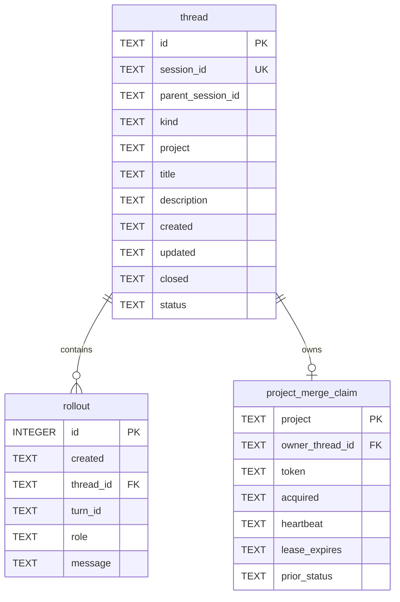

# Data model

`agtask` stores a local, searchable projection of Codex task state in
`~/.llm/agtask/ledger.db`. Codex remains authoritative for the complete
conversation and native rollout history. The ledger contains only current
thread state, task kind, project identity, origin lineage, bounded turn
summaries, lifecycle events, and short-lived project merge claims.

The canonical schema is version 6. Its executable source of truth is `DDL` in
[`skills/agtask/scripts/agtask`](../skills/agtask/scripts/agtask).
This document describes that schema and the application contract around it.

## Storage contract

- The default database is `~/.llm/agtask/ledger.db`.
- `AGTASK_DB` overrides the path for isolated environments and tests.
- The database directory is mode `0700`. The database, WAL, and shared-memory
  files are mode `0600`.
- Connections enable foreign keys, use WAL after schema compatibility is
  established, and set a 1,000 ms busy timeout.
- Timestamps written by the application are UTC RFC 3339 strings with
  millisecond precision, for example `2026-07-16T18:28:46.513Z`.
- `PRAGMA user_version` is `6`. Existing databases are inspected read-only
  before a writer opens them. An exact version-5 schema is migrated
  transactionally to version 6; a missing database or empty version-0 database
  may be initialized. Any other shape is rejected without project backfill.

## Entity relationship



There is one `thread` row for each tracked Codex task and zero or more ordered
`rollout` rows for its summarized conversation and lifecycle history. A thread
may own at most one short-lived project merge claim.

## `thread`

`thread` is the current-state record for a tracked Codex task.

| Column | SQLite declaration | Contract |
| --- | --- | --- |
| `id` | `TEXT PRIMARY KEY NOT NULL` | Canonical UUIDv4. Creation workflows generate it before child creation or main designation; direct `add` generates it inside the CLI transaction. It identifies one logical registration and is not a credential. |
| `session_id` | `TEXT NOT NULL UNIQUE` | Real Codex session ID bound to this logical task. |
| `parent_session_id` | `TEXT` | Invoking Codex session for child kind; null for main kind. It may refer to an untracked session. |
| `kind` | `TEXT NOT NULL` | `main` for a root dispatcher or `child` for a dispatched task. |
| `project` | `TEXT NOT NULL` | Nonempty project label resolved explicitly or from the project-directory basename. |
| `title` | `TEXT NOT NULL` | Current tracked title. Registration initializes it and requires an exact value on reconciliation; token-fenced rename apply may change it later. |
| `description` | `TEXT NOT NULL DEFAULT ''` | Immutable normalized summary derived from the initial creation prompt. |
| `created` | `TEXT NOT NULL` | Registration timestamp. It never changes. |
| `updated` | `TEXT NOT NULL` | Timestamp of the latest state or recorded-turn update. |
| `closed` | `TEXT` | Terminal timestamp. Non-null exactly when `status` is `done` or `drop`. |
| `status` | `TEXT NOT NULL` | One of `todo`, `active`, `blocked`, `merging`, `done`, or `drop`. `done` records successful completion; `drop` records intentionally abandoned work; `merging` projects ownership of a project merge claim until it is committed, released, or reaped. |

The database enforces these row constraints:

- `status IN ('todo', 'active', 'blocked', 'merging', 'done', 'drop')`.
- `done` and `drop` require a non-null `closed`; every other status requires
  `closed` to be null.
- `id` and `session_id` are nonempty; `session_id` is globally unique.
- A row cannot name its own `session_id` as `parent_session_id`.
- `kind IN ('main', 'child')`.
- A main thread has no parent. A child thread has a non-null parent.
- `project` is nonempty after trimming.

`parent_session_id` deliberately has no foreign key. It records origin lineage,
not ownership or copied-context semantics, and the invoking thread does not
need to be tracked locally. Main threads are root dispatchers and always store
null lineage; child threads store the invoking session ID in both clean and fork
modes. Kind, project, and parent lineage are immutable after registration;
ordinary re-registration also treats the session and description as immutable.
The narrow exception is authoritative one-shot reconciliation of a provisional
copied-helper binding, which replaces the session and prompt-derived
description before canonical task history is recorded. Direct `add` treats the
current Codex title as an exact reconciliation value and rejects a session
already stored as child kind. Version 6 is an exact-schema compatibility
boundary; the CLI does not migrate version-4 ledgers in place.

### Thread indexes

| Index | Columns | Purpose |
| --- | --- | --- |
| `thread_session_id_idx` | Unique `session_id` | One logical task per real Codex session. |
| `thread_created_idx` | `created` | Creation-order inspection. |
| `thread_status_updated_idx` | `status, updated` | Status-filtered current-state queries. |
| `thread_parent_session_idx` | `parent_session_id` | Child and lineage lookup. |
| `thread_project_merging_idx` | `project` where `status = 'merging'` | Defensive enforcement that at most one thread per project projects merge ownership. |

`list` returns rows ordered by `updated DESC, created DESC`, optionally filtered
by `status`.

## `project_merge_claim`

`project_merge_claim` is the authoritative mutual-exclusion lease. It contains
at most one row for an exact stored project label; waiting tasks create no row.

| Column | SQLite declaration | Contract |
| --- | --- | --- |
| `project` | `TEXT PRIMARY KEY NOT NULL` | Exact immutable `thread.project` label being serialized. |
| `owner_thread_id` | `TEXT NOT NULL UNIQUE` | Current owner; cascades away if the owning thread is deleted. |
| `token` | `TEXT NOT NULL UNIQUE` | Opaque fencing token required to heartbeat, cancel, or commit close. |
| `acquired` | `TEXT NOT NULL` | Initial claim timestamp. |
| `heartbeat` | `TEXT NOT NULL` | Most recent successful renewal. |
| `lease_expires` | `TEXT NOT NULL` | UTC expiry compared lexicographically using the canonical timestamp format. |
| `prior_status` | `TEXT NOT NULL` | Latest underlying `todo`, `active`, or `blocked` lifecycle state; initialized at claim time, updated by turns while merging, and restored on cancel or stale takeover. |

`close --prepare` runs under `BEGIN IMMEDIATE`, reaps an expired claim, and
either installs one new row plus `status:<prior>->merging`, renews the same
owner's existing token, or returns a read-only waiting result. Heartbeat only
renews a matching unexpired token. Cancel accepts the still-matching owner token
even after expiry so an owner can clean up before takeover; stale takeover
fences that old token by replacing the row. Both paths delete the claim and
restore `prior_status`. Final close validates an unexpired token and atomically
records `merging->done`, appends finalization, and deletes the claim.

The claim is scoped by the exact project label, not a repository path or remote
identity. Consequently same-named unrelated projects intentionally contend in
one local ledger, while different labels do not. Randomized retry has
best-effort fairness and may starve under sustained contention; strict FIFO
would require durable waiter rows, stale-waiter cleanup, and more cancellation
state, which version 6 deliberately avoids.

### Dashboard projection and status mutation

`dashboard` does not change the schema. Its grouped JSON mode and dashboard
HTTP API read every current `thread` row through an
explicit nine-column projection: logical `id`, `session_id`,
`parent_session_id`, `project`, `title`, `created`, `updated`, `closed`, and
`status`. They never return kind,
description, rollout history, HTML, or preformatted timestamps.

The token-scoped task-detail API resolves its route by `session_id` and projects
logical `id`, `session_id`, `parent_session_id`, `title`, `description`,
`created`, and `updated`. It adds rollout values
projected as `created`, `role`, and `message`, ordered by `created DESC, id DESC`.
The rollout ID is only a deterministic tie-breaker and is not returned. Both
dashboard projections remain read-only and leave the persisted rows unchanged.

The token-scoped browser server also accepts one status mutation for a task
resolved by `session_id`. Its JSON body carries both the rendered
`expected_status` and requested `status`. Under `BEGIN IMMEDIATE`, the server
requires the current value to equal the expected value and then reuses the
manual status transition contract. `todo`, `active`, `blocked`, and `drop` are
valid targets. A real change advances `updated` and appends one
`status:<old>-><new>` meta rollout with the same timestamp; `drop` sets
`closed`, while nonterminal targets clear it. A same-state request is a no-op.
Stale, `merging`, and terminal rows fail without writes, preserving
merge-claim, close, and reopen ownership.

The snapshot derives project, parent, and lifecycle-status facets before any
filter is applied, so facet counts always describe the complete ledger. Exact
values within project, parent, and status dimensions are ORed; the dimensions
and title search are ANDed. Root-parent selection matches null
`parent_session_id`. Title search is a literal Python `casefold()` substring and
does not reuse FTS, match descriptions, or interpret query syntax.

The HTML client renders one chip per active dimension. A chip may display
multiple ORed values, while multiple chips are the browser representation of
the server's AND-across-dimensions contract. Adding, toggling, or removing a
chip value rewrites the canonical query and requests a fresh snapshot; it does
not change persistence or filter evaluation.

Visible rows are emitted in fixed `todo`, `active`, `blocked`, `merging`,
`done`, `drop` groups.
With no status filter all six groups exist even when empty; a status filter
emits only selected groups in the same lifecycle order. Created, updated, or
closed timestamp sorting applies inside each group. Null primary timestamps
sort last in either direction, followed by deterministic `updated DESC`,
`created DESC`, and `id ASC` ties. Filters and facets are exact-deduplicated and
ordered deterministically; status arrays use lifecycle order.

Each HTTP API refresh opens, validates, reads, and closes a new ledger
connection. `dashboard --json` performs the same single snapshot without an
HTTP listener and never writes. The browser status endpoint opens a separate
validated write connection for its immediate transaction; no other dashboard
path inserts, updates, deletes, transitions status, or appends rollouts.

## `rollout`

`rollout` is the append-oriented event history for a tracked thread. Lifecycle
commands normally append rows; bootstrap reconciliation is the one path that
may promote an existing bootstrap row by replacing its `turn_id` with the real
Codex turn ID.

| Column | SQLite declaration | Contract |
| --- | --- | --- |
| `id` | `INTEGER PRIMARY KEY` | SQLite row identifier and deterministic tie-breaker for equal timestamps. |
| `created` | `TEXT NOT NULL` | Event timestamp. |
| `thread_id` | `TEXT NOT NULL` | Owning thread. References `thread(id)` with `ON DELETE CASCADE`. |
| `turn_id` | `TEXT NOT NULL` | Stable event identity supplied by Codex, reserved by the workflow, or generated by the CLI. |
| `role` | `TEXT NOT NULL` | One of `user`, `assistant`, or `meta`. |
| `message` | `TEXT NOT NULL` | Bounded, normalized human-readable summary. |

The database enforces the role set with
`CHECK (role IN ('user', 'assistant', 'meta'))`. The CLI additionally rejects
empty event IDs and messages that normalize to an empty string.

`message` is presentation data, not identity. The normalizer unwraps supported
task/delegation prompt wrappers, removes an exact final validated agtask
bootstrap envelope, removes common Markdown prefixes, collapses
whitespace to one line, selects the first sentence when present, and caps the
result at 240 Unicode code points with a trailing ellipsis when truncated. Raw
prompts, bootstrap control metadata, raw assistant transcripts, and message
hashes are not stored.

Only inside a valid Codex delegation wrapper, the complete transported
`<input>` is HTML-decoded exactly once before summary, bootstrap-removal, and
action validation. This restores transport-escaped task text, tag delimiters,
and JSON while preserving literal pre-escaped content after its outer layer is
removed. Unwrapped prompts are never HTML-decoded. The recovered JSON must
still be canonical, typed, allowlisted, and final.

### Rollout indexes and uniqueness

| Index | Definition | Contract |
| --- | --- | --- |
| `rollout_thread_order_idx` | `(thread_id, created, id)` | Ordered history lookup for one thread. |
| `rollout_turn_event_idx` | Unique `(thread_id, role, turn_id)` where `role IN ('user', 'assistant')` | At most one event for each thread, conversational role, and Codex turn ID. |
| `rollout_meta_event_idx` | Unique `(thread_id, turn_id)` where `role = 'meta'` | At most one lifecycle event for each thread and meta event ID. |

The role-aware conversational key allows a user and assistant event to share a
Codex turn ID. Meta identity is independent of conversational roles. For any
unique event key, replaying the same normalized message is a successful no-op;
reusing the key for a different message is a conflict. Direct CLI commands
surface that conflict. Hook processing leaves the committed row unchanged and
fails open.

`show` returns rollouts newest first by `created DESC, id DESC`. Session-start
context uses the five newest rows in the same order but renders only `role` and
`message`, keeping database and event IDs internal.

## Full-text search projection

`thread_fts` is an external-content FTS5 table over `thread.title` and
`thread.description`:

```sql
CREATE VIRTUAL TABLE thread_fts USING fts5(
  title,
  description,
  content='thread',
  content_rowid='rowid'
);
```

The projection uses the `thread` rowid and is maintained by three SQLite
triggers:

| Trigger | Timing | Effect |
| --- | --- | --- |
| `thread_ai` | After thread insert | Insert the new title and description into FTS. |
| `thread_ad` | After thread delete | Submit the FTS external-content delete record. |
| `thread_au` | After update of title or description | Delete the old projection and insert the new values. |

SQLite manages the FTS5 shadow tables `thread_fts_data`, `thread_fts_idx`,
`thread_fts_docsize`, and `thread_fts_config`. Exact-schema verification expects
those generated objects together with the declared tables, indexes, and
triggers.

Lifecycle rollouts are not indexed by FTS. `search` performs a literal FTS
match against the title/description projection, joins back to `thread` by
rowid, and orders by BM25 rank then `thread.updated DESC`.

These FTS synchronization triggers are the only triggers that write derived
state. The application writes every lifecycle rollout explicitly so event
identity and the corresponding thread transition stay in one transaction.

## Event identities

| Event | Role | `turn_id` | `message` |
| --- | --- | --- | --- |
| Thread registration (`add` or `register`) | `meta` | `thread.created` | `thread.created` |
| User prompt | `user` | Codex `turn_id` | Normalized prompt summary. |
| Assistant result | `assistant` | Codex `turn_id` | Normalized final-result summary. |
| Bootstrap prompt repair | `user` or `assistant` | Reserved `bootstrap`, later promotable | Same normalized summary as the real turn. |
| Status transition | `meta` | Fresh opaque UUID hex generated inside the transaction | `status:<old>-><new>` |
| Title rename | `meta` | Fresh opaque UUID hex generated inside the rename transaction | `title:renamed` |
| Compaction | `meta` | `compact:<codex-turn-id>:<manual-or-auto>` | `compaction:<manual-or-auto>` |
| Successful finalization | `meta` | Fresh opaque UUID hex generated inside the close transaction | `finalization:completed` |

The `thread.created` rollout occurs once per thread. Ordinary re-registration
requires the exact same ID, session ID, title, and immutable metadata; its
description must match and is never rewritten. Existing exact-pair
registration is verification-only: it preserves lifecycle state and does not
create another registration rollout. Authoritative one-shot reconciliation may
replace a provisional helper session and description while preserving the
single `thread.created` event and removing copied helper conversation rows.
Direct `add` selects by real session ID instead of accepting a logical ID. For
an untracked session it generates and stores a UUIDv4 logical ID, active main
kind, and null parent lineage in one transaction. For an existing main session
it reuses the stored ID and applies the same exact project, title, and
description checks; an existing child session is rejected.
Same-state status
and close operations do not create events. Repeating a transition after an
intervening state change is a real new event and therefore receives a fresh ID.

These identities are application conventions layered on the uniqueness
indexes, not additional SQLite checks. In particular, the general
`append-rollout` command can write any non-empty event ID for any allowed role;
callers must not reuse identities reserved for canonical lifecycle events.

Bootstrap exists to reconcile the race between explicit task creation and the
real hook. Version 1 is action-only and never creates ledger state. The
canonical child-creation version 2 adds a required canonical UUIDv4 `id`,
`parent_session_id`, and `project` to the strict pin/title envelope. On the
first `UserPromptSubmit`, an untracked real session with a valid version-2
envelope binds the creation ID to the hook payload's `session_id`, registers the
child, and records its real user turn under the logical ID in one
`BEGIN IMMEDIATE` transaction. This lets a
queued worktree materialize after its parent has received only a client ID,
without losing the first prompt. Codex delegation transport may entity-escape
the complete delegation input; exactly one entity layer is decoded so task text
and JSON round-trip together while pre-escaped literal task text is preserved.
Concurrent first hooks serialize schema initialization and registration through
SQLite transactions. Version-2 title and pin actions target `session_id` and
are rendered only after the registration and real-turn write commit.

The creation ID is a correlation nonce, not an authentication token. Under the
same immediate transaction, an unclaimed ID inserts only when the session ID is
also unclaimed; the same `(id, session_id)` pair reconciles idempotently after
immutable metadata validation; and hook-side conflicts perform no writes or
actions. Parent-side `register --authoritative-session` is the narrow exception:
when a copied helper won first, the requested session must be unclaimed,
lineage/kind/project/title must match, and the stored active row must have one
creation event, one user turn, and no other metadata. The transaction discards
copied user/assistant rows, rebinds to the returned primary session, and stores
the primary prompt description. Primary-key and unique-session constraints
remain race backstops.

Parent-side registration supplies both `--id` and `--session-id`; it and the
reserved bootstrap write remain retries. A
hook-first register returns no `OnCreate` prompt because that configured prompt
was already embedded in the accepted creation turn. Registration derives
`thread.description` from `--initial-prompt`;
an optional `--description` is only a compatibility assertion and must
normalize identically. The first user rollout and every user `bootstrap` write
must also normalize to the stored description:

1. An exact event replay is a no-op.
2. A matching same-role bootstrap row is promoted to the real `turn_id` when it
   is the only non-real candidate and doing so cannot place a promoted user
   event before an already-recorded assistant event.
3. If the matching real event arrived first, the later bootstrap write is a
   no-op.
4. A bootstrap initial prompt that conflicts with the registered description
   is rejected. Once a compatible initial user rollout exists, later distinct
   user messages remain ordinary separate events.

All read-check-write event paths use `BEGIN IMMEDIATE`, so retries from
concurrent writers serialize before checking uniqueness or state.

## Status and timestamp lifecycle

```mermaid
stateDiagram-v2
    [*] --> todo: register before first prompt
    [*] --> active: direct, one-shot, or v2 hook registration
    todo --> active: user turn
    active --> blocked: raw assistant result starts with Blocked:
    blocked --> active: user turn or non-blocked assistant result
    todo --> merging: acquire project claim
    active --> merging: acquire project claim
    blocked --> merging: acquire project claim
    merging --> todo: cancel or stale lease
    merging --> active: cancel or stale lease
    merging --> blocked: cancel or stale lease
    merging --> done: fenced close
    active --> done: confirmed archived-session audit
    done --> active: reopen
    todo --> drop: explicit status
    active --> drop: explicit status
    blocked --> drop: explicit status
    drop --> active: reopen
```

The explicit `status` command may move any nonterminal thread among `todo`,
`active`, and `blocked`, or end it as `drop`, except that a merging thread must
first be closed or have its claim released. A terminal thread must be reopened
before other explicit updates. Exact-pair re-registration is verification-only
and does not alter lifecycle state, including `merging`, `done`, and `drop`.
The confirmed archive audit is the only direct `active -> done` path; its
unchanged plan token binds the user-reviewed active row snapshot to the write.

Status and timestamp rules are:

- Initial registration sets `created` and `updated` to the same timestamp and
  leaves `closed` null.
- A title or description mismatch is rejected; an otherwise identical
  re-registration is a no-op for every existing lifecycle state. Its `status`
  argument is used only when inserting a new row.
- Authoritative one-shot reconciliation of a provisional helper binding sets
  the returned primary session, prompt-derived description, requested active
  status, and a fresh `updated` timestamp while preserving `created` and the
  single `thread.created` event.
- Rename planning is read-only and returns an exact Codex title action plus a
  deterministic SHA-256 token bound to protocol version, logical ID, session
  ID, current title, and requested title. Apply recomputes that token under
  `BEGIN IMMEDIATE`; routine rollout activity does not invalidate the plan,
  while a competing title change or different requested title makes no writes.
  A real change gives the new `title`, `updated`, and `title:renamed` rollout
  one timestamp and refreshes the FTS projection in the same transaction. An
  accepted same-title apply is a no-op. Invalid plans make no writes.
- Recording a new user or assistant turn leaves `description` unchanged and
  advances `updated` while retaining the normalized message in `rollout`.
- `append-rollout` and compaction writes are history-only: they do not change
  the owning thread. Consequently, `thread.updated` is the last current-state
  or recorded-turn update, not necessarily the timestamp of the newest
  rollout.
- On a nonterminal, non-merging thread, a user turn selects `active`. An assistant turn selects
  `blocked` only when the raw content starts exactly with `Blocked:`;
  otherwise it selects `active`. Turns recorded during OnPreClose append their
  rollout and advance `updated` while preserving the visible `merging` status;
  the same inference updates the claim's underlying `prior_status` so cancel or
  stale recovery restores the latest result.
- Ordinary turn hooks may advance the `updated` timestamp of a terminal thread
  and append its rollout, but they do not change its description or move it out
  of `done` or `drop`; only `reopen` changes the terminal status.
- When an assistant Stop event is recorded before the initial bootstrap write
  is verified, the matching bootstrap write keeps the assistant-selected
  `active` or `blocked` status instead of projecting the earlier user prompt
  over that newer lifecycle state.
- An actual status change advances `updated`, adjusts `closed`, and appends its
  status rollout in the same transaction. A same-state request changes
  neither timestamps nor history.
- Claiming sets `status = 'merging'`; waiting and heartbeat do not append
  lifecycle events. Turns may update the claim's underlying status without a
  visible transition; cancel or stale reaping restores that latest value.
- A fenced `close` sets `status = 'done'` and gives `updated`, `closed`, the
  `status:merging->done` rollout, and the finalization rollout the same timestamp.
- A confirmed archive audit moves only a still-`active` row whose Codex
  `session_id` was positively observed as archived to `done`. It gives
  `updated`, `closed`, `status:active->done`, and
  `archival:codex-thread-archived` one timestamp. Missing, omitted, failed, or
  non-archived observations never mutate a row. The audit does not create a
  merge claim or finalization event because the underlying Codex thread is
  already archived.
- Explicit Drop sets `status = 'drop'`, gives `updated`, `closed`, and
  `status:<prior>->drop` one timestamp, and does not create merge or
  finalization evidence.
- Repeated close is a no-op. `reopen` changes `done` or `drop` to `active`,
  clears `closed`, advances `updated`, and records
  `status:<terminal>->active`. A later close is a distinct lifecycle with new
  status and finalization event IDs.

The application provides timestamp formatting; SQLite constrains nullability
and the status/closed relationship but does not parse or compare timestamp
text.

## Hook mapping

Codex calls the tracked object a session in hook payloads. The hook adapter
queries `thread.session_id`, retrieves the logical `thread.id`, and persists
rollouts and lifecycle ownership by that logical ID. Codex-owned hook fields,
app-action `threadId` values, and deep links continue to use the session ID.

| Codex hook | Ledger operation | Thread state effect | Output |
| --- | --- | --- | --- |
| `UserPromptSubmit` | Validate an exact final bootstrap envelope. For valid version 2, atomically bind its logical ID to the payload session, register an untracked child from the prompt metadata, and record one `user` rollout by logical owner and real Codex turn ID; otherwise record only when the session is already tracked. | New hook-owned children start `active`; existing rows preserve description and select `active` unless terminal or bootstrap reconciliation must preserve a later assistant state. While merging, keep the visible status and update the claim's underlying state. | Version 1 renders action-only context. Version 2 renders allowlisted bootstrap actions plus tracked context only after exact-pair reconciliation commits; copied or conflicting bindings are silent. |
| `Stop` | Record one `assistant` rollout by Codex turn ID. | Preserve description; select `blocked` for an exact leading `Blocked:`, otherwise `active`, unless terminal. While merging, keep the visible status and update the claim's underlying state. | None. |
| `PostCompact` | Append one deterministic `meta` rollout. | None. | None. |
| `SessionStart` | Read the thread and five newest rollouts. Its payload has no prompt, so it cannot parse bootstrap metadata. | None. | Render tracked context for supported start sources. |

Hooks are silent for a missing ledger or untracked thread unless a valid
version-2 creation envelope authorizes initialization and child registration.
They fail open on malformed payloads, unsafe permissions, incompatible schemas,
registration conflicts, and lock timeouts so bookkeeping cannot interrupt Codex
work. Explicit CLI commands fail closed and roll back their transaction.

## Read and write ownership

| Component | Reads | Writes |
| --- | --- | --- |
| Codex | Native conversation and rollout history. | Native conversation and rollout history; it does not write SQLite directly. |
| `agtask` skill workflow | Current Codex task metadata and paged oldest user text for direct add; resolved creation ID, designation/creation inputs, typed bootstrap arguments, structured `OnCreate` prompt data, post-commit JSON returned by registration and child bootstrap recording, current tracked title for rename coordination, and audit lookup requests keyed by real `session_id`. | Adds the invoking task without app mutation; designates, pins, and titles the invoking session directly for main kind; creates child tasks; preserves the resolver's logical ID through creation; composes the canonical final bootstrap trailer into child initial turns; registers the exact `(id, session_id)` pair with kind, project, and parent-session lineage; coordinates current-task rename across the Codex app and ledger with compensation on ledger failure; obtains Codex archive observations; and asks the user to confirm the exact audit plan before apply. |
| Bundled `agtask` CLI | Layered `.agtask.json` files, schema, thread state, rollout history, project merge claim, FTS search, and caller-supplied versioned Codex archive observations. | The only application-level SQLite writer: initial-prompt-derived registration, token-fenced title rename apply, status transitions, immutable-description `record-turn` updates, history-only `append-rollout` writes, claim/heartbeat/release operations, close/reopen lifecycle, and confirmed archive reconciliation. It never calls Codex app APIs; rename and audit planning are read-only, and each apply requires its unchanged plan token. It returns prompt or app-action data but never executes or persists it. |
| Codex hook adapter in the CLI | Hook payload, the allowlisted typed bootstrap registry, plus thread and recent-rollout state selected by session when present. | Deterministically validates bootstrap metadata and renders structured `hookSpecificOutput.additionalContext`; a valid version-2 first prompt may initialize the ledger, bind creation ID to real child session ID, and append creation plus user rows atomically. It otherwise writes user, assistant, and compaction rollouts only under the logical ID of tracked sessions. `SessionStart` is read-only. |
| Child Codex model | Validated bootstrap action context containing its real session ID and resolved title. | Performs model-mediated Codex app actions such as idempotent pinning and self-renaming, reports each failure, and does not write SQLite directly. |
| Codex lifecycle orchestration | `hook_prompts` entries from create, close preparation, and committed close results; audit lookup requests; and Codex app thread reads. | Delivers configured prompt text to Codex when appropriate, maps exact per-session archive reads into versioned audit observations, shows affected tasks and unresolved lookups, and forwards the CLI plan token only after explicit user confirmation. It does not write SQLite directly. |
| SQLite FTS triggers | Old and new `thread` title/description values. | Only the derived `thread_fts` projection. |

Deleting a `thread` row would cascade to its rollouts, but the current CLI has
no thread-delete command. Full transcript storage, Codex thread creation, task
titles in the Codex service, and finalization gates remain outside the ledger's
persistence ownership. Current-task rename therefore crosses two independent
stores: the CLI first returns a read-only plan, orchestration executes its
Codex action, and the CLI applies the token-fenced ledger update second. On
apply failure orchestration re-reads the row and restores the Codex app to that
current title, using the planned title only when the row cannot be read. A
failed compensation is surfaced as explicit title divergence; neither the CLI
nor the workflow claims distributed atomicity.

Configuration is also outside the persistence contract. The CLI loads
`$HOME/.agtask.json` and `./.agtask.json` at invocation time, with the project
file overlaying the home file recursively. Neither the merged defaults nor raw
prompt hook text is copied into SQLite. `init` creates the global file with the
bundled defaults only when it is absent and reports whether creation occurred;
it does not overwrite an existing configuration.

## JSON boundary

`show --json` returns all eleven `thread` columns, including logical `id`,
Codex `session_id`, and `parent_session_id`, plus `rollouts`. Every rollout
contains `id`, `created`, `thread_id`, `turn_id`, `role`, and `message`.
`add`, `register`, `status`, `reopen`, `close`, `append-rollout`, and `record-turn`
return the same post-commit thread shape when JSON output is requested. Rename
planning returns identity, current/requested titles, timestamp, exact app
action, and token without writing; accepted apply returns the post-commit
thread under `thread` plus `applied` and `changed`.
Registration requires both identity values. Other explicit thread-targeting
commands accept exactly one of `--id` (logical creation ID) or `--session-id`
(Codex identity), resolve it to the same logical row, and keep rollout and merge
claim ownership keyed by `thread.id`. Rename is the exception: both planning
and apply require `--session-id` because the plan contains a Codex app action.
An untracked
`close --if-tracked --session-id ... --json` result can return the requested
session ID but does not fabricate a logical ID.
`audit --json` returns active task snapshots and one Codex lookup request per
real `session_id`. A strict version-1 observation document classifies each
session as `archived`, `not_archived`, `missing`, or `error`; it is transient
input and is never persisted. Planning returns `affected_tasks`, `unresolved`,
`ignored_observations`, and an exact `plan_token`. Confirmed apply recomputes
that token under `BEGIN IMMEDIATE` before writing, so a changed active row is
not silently archived.
`resolve-create`, a newly inserted direct `add` row, and a newly inserted
parent-side `register` row also return the pending or triggered `OnCreate`
prompt. An exact add retry and a parent registration retry after hook-owned
creation return an empty prompt list. `close --prepare` returns
`OnPreClose` only after an atomic claim write; a waiting prepare returns no
prompt and no write, while a state-changing fenced `close` returns `OnPostClose`.
Lifecycle commands always include `hook_prompts`, using an empty array for a
disabled hook, an idempotent committing retry, or an untracked close. Prompt entries carry
`event`, `prompt`, and the winning configuration `source`. This returned
snapshot is the workflow's normal write-verification and orchestration
boundary. Claimed, waiting, heartbeat, cancel, and completed close results also
include `merge_claim`; only the claimed form includes its opaque token, and only
the waiting form includes randomized `retry_after_ms`. Prompt data is not a
rollout and does not affect schema version 6.
