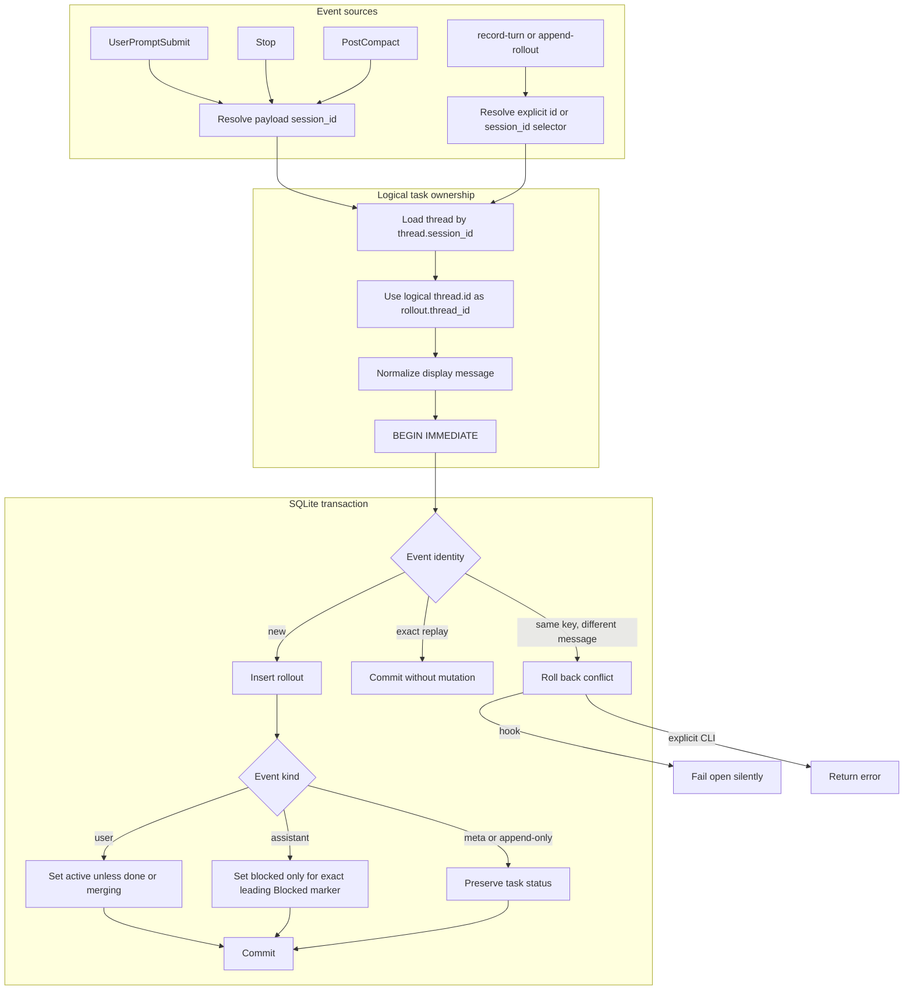

# Rollout Update Flow

## Overview

This flow traces how Codex conversation events and explicit lifecycle events
become normalized rollout rows. It explains session lookup, logical ownership,
idempotency, status derivation, and the difference between conversational and
history-only writes.

## Entry Points

- `skills/agtask/assets/hooks.json:hooks`
- `skills/agtask/scripts/agtask:handle_hook`
- `skills/agtask/scripts/agtask:record_turn`

## Sequence Diagram



## Execution Trace

### 1. Resolve the tracked task

Codex hooks enter with a real `session_id`. The adapter looks up
`thread.session_id`, then passes the row's logical `thread.id` to rollout and
lifecycle helpers.

#### 1.1 Map session identity to logical ownership

- `skills/agtask/scripts/agtask:handle_hook`

```ts
thread := SELECT thread WHERE session_id = payload.session_id
if thread is absent
  return hook_success_without_output
logical_id := thread.id
```

Direct commands instead accept exactly one `--id` or `--session-id` selector
and resolve it to the same row.

### 2. Normalize and classify the event

The CLI unwraps supported task and delegation shapes, removes common Markdown
prefixes, collapses whitespace, selects the first sentence when present, and
caps stored messages at 240 Unicode code points.

#### 2.1 Select role and desired lifecycle state

- `skills/agtask/scripts/agtask:record_turn`

```ts
message := normalize_rollout(raw_content)
if role == "user"
  desired_status := "active"
else if role == "assistant" and raw_content starts_with "Blocked:"
  desired_status := "blocked"
else if role == "assistant"
  desired_status := "active"
```

Status derives from raw assistant content before normalization. The stable task
description continues to come only from the initial creation prompt.

### 3. Write or reconcile idempotently

Every read/check/write sequence takes a SQLite write reservation before
checking event identity. A real initial prompt and the reserved `bootstrap`
fallback may reconcile to one user rollout.

#### 3.1 Apply role-aware event identity

- `skills/agtask/scripts/agtask:record_turn`

```ts
begin_immediate()
existing := find_rollout(thread_id, role, turn_id)
if existing.message == message
  commit_without_mutation()
else if existing exists
  rollback_conflict()
else
  insert_rollout(thread_id, role, turn_id, message)
  apply_allowed_status_transition()
  commit()
```

For user and assistant events, the idempotency key is
`(thread_id, role, turn_id)`. Meta events use `(thread_id, turn_id)`.

### 4. Preserve terminal and history-only state

Ordinary conversation may advance `updated`, but it cannot leave `done`.
While a project merge claim is live, ordinary turns update the claim's saved
underlying status rather than replacing visible `merging`.

#### 4.1 Handle compaction and append-only history

- `skills/agtask/scripts/agtask:append_rollout`

```ts
if event is PostCompact
  append_meta("compact:" + turn_id + ":" + trigger)
if command is append_rollout
  append_role_aware_event_only()
preserve thread.description
preserve thread.status
```

Only `reopen` leaves `done`; compaction and explicit append-only writes do not
change the thread row.

## Notes

- `UserPromptSubmit` owns `user` rollouts and `Stop` owns `assistant` rollouts.
  Registration, status transitions, compaction, and finalization use `meta`.
- Hooks fail open on missing ledgers, unknown sessions, lock timeouts, malformed
  payloads, and event conflicts. Explicit commands fail closed.
- A matching `bootstrap` rollout is promoted or ignored when the real
  `UserPromptSubmit` event arrives, depending on arrival order.
- A fast `Stop` may commit before initial-prompt reconciliation. Later bootstrap
  verification preserves the assistant-selected status.
- A new ordinary turn on a completed task may update history and `updated`, but
  the task remains `done`.

## Observability

Metrics:
- None identified.

Logs:
- Explicit CLI conflicts print an `agtask:` error to stderr and exit nonzero.
- Hook failures intentionally produce no user-visible error so bookkeeping does
  not interrupt Codex.

## Related docs

- [Task creation](task-creation.md)
- [Session identity binding](session-identity-binding.md)
- [Task closing](task-closing.md)
- [Flow index](README.md)
- [Data model](../data_model.md)

## Manual Notes

[keep this for the user to add notes. do not change between edits]

## Changelog
- 2026-07-21 10:07: Split rollout persistence and status derivation into a dedicated runtime flow (019f6e7b-6fee-7b22-9ee7-0448a1431036 - d0ab5633f6fc478e631614a90bf4c7e2054faafa)
