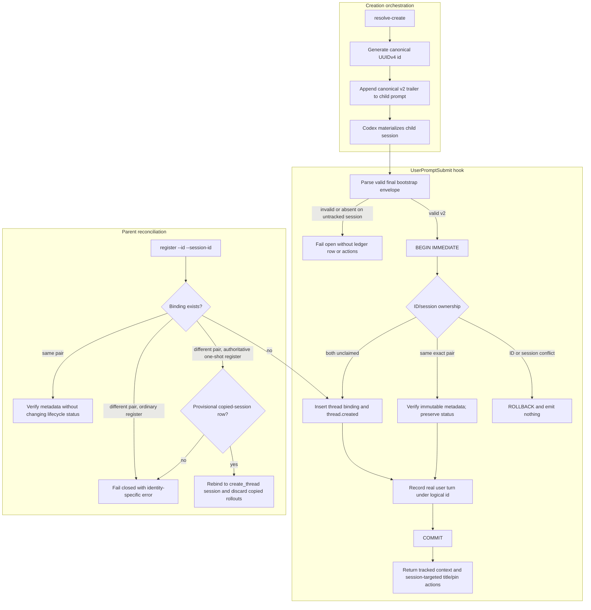

# Session Identity Binding Flow

## Overview

This flow traces a child creation from the pre-creation logical UUID through
the first Codex `UserPromptSubmit` hook and SQLite binding. It explains how one
creation ID is bound to one real Codex session, how copied bootstrap prompts
are rejected, and how parent-side registration converges without changing
later lifecycle state.

## Entry Points

- `skills/agtask/references/create.md:Build the child prompt`
- `skills/agtask/scripts/agtask:command_resolve_create`
- `skills/agtask/scripts/agtask:handle_hook`

The resolver creates the UUID and final trailer. The hook receives the real
Codex session ID and binds or rejects the pair. Parent-side registration calls
the same binding primitive before or after the hook.

## Sequence Diagram



## Execution Trace

### 1. Generate the creation identity

The resolver creates the logical ID before Codex creates the child. That ID is
non-secret correlation data and is carried only in the strict final version-2
bootstrap envelope.

#### 1.1 Resolve the child inputs

- `skills/agtask/scripts/agtask:command_resolve_create`

```ts
creation_id := str(uuid.uuid4())
bootstrap_arguments := {
  id: creation_id,
  parent_session_id: args.parent_session_id,
  pin: pin,
  project: project,
  title: title,
}
bootstrap_trailer := bootstrap_trailer(bootstrap_arguments, version=BOOTSTRAP_VERSION)
```

The parent retains `creation_id`. A returned Codex `threadId` is stored
separately as `session_id`; pending client/worktree IDs are not session IDs.

### 2. Validate the first prompt

The global hook receives the real `payload.session_id`. Delegation-shaped
prompts are unwrapped only when the complete wrapper is valid, and the wrapped
`input` is HTML-decoded exactly once before the final trailer is parsed.

#### 2.1 Parse the canonical envelope

- `skills/agtask/scripts/agtask:prompt_payload`
- `skills/agtask/scripts/agtask:parse_bootstrap_envelope`

```ts
prompt := payload.prompt
envelope := parse_bootstrap_envelope(prompt)
if envelope is invalid
  envelope := None
if envelope.version == BOOTSTRAP_VERSION
  registration_arguments := envelope.arguments
  deferred_v2_action_context := bootstrap_action_context(prompt, external_session_id)
```

Missing, malformed, non-v4, noncanonical, non-final, duplicate-key, or
extra-field envelopes cannot register an untracked session or render actions.

### 3. Bind the pair transactionally

The hook opens schema version 6 and takes a write reservation before reading
either unique identity. SQLite primary-key and unique-index constraints remain
backstops; the application classifies conflicts before attempting a write.

#### 3.1 Apply the ownership matrix

- `skills/agtask/scripts/agtask:handle_hook`
- `skills/agtask/scripts/agtask:register_thread`

```ts
connection.execute("BEGIN IMMEDIATE")
session_row := thread_by_session(connection, external_session_id)
logical_id := registration_arguments.id
id_row := SELECT thread WHERE id = logical_id

if id_row belongs to another session or session_row belongs to another id
  connection.rollback()
  return

register_thread(
  thread_id=logical_id,
  session_id=external_session_id,
  parent_session_id=registration_arguments.parent_session_id,
  kind="child",
  project=registration_arguments.project,
  title=registration_arguments.title,
  initial_prompt=prompt,
  status="active",
)
```

An unclaimed pair inserts `(id, session_id)` plus one `thread.created` rollout.
An existing exact pair verifies immutable identity, lineage, project, title,
and description without changing status. A copied title-generation session
that presents an already-bound ID rolls back and receives no context or action
instructions.

### 4. Record the real turn and return child actions

After binding or exact-pair verification, the hook writes the conversational
turn using the logical ID. The action renderers still target the Codex session
ID because title, pin, routes, and deep links are platform operations.

#### 4.1 Commit the tracked turn

- `skills/agtask/scripts/agtask:record_turn`
- `skills/agtask/scripts/agtask:thread_context`

```ts
record_turn(
  thread_id=logical_id,
  role="user",
  turn_id=payload.turn_id,
  content=prompt,
)
connection.commit()
user_prompt_context.append(deferred_v2_action_context)
user_prompt_context.append(thread_context(connection, logical_id))
```

An exact turn retry is a no-op. A new user turn may update ordinary lifecycle
state, but a completed or dropped task stays terminal and a merging task
updates only its saved post-merge status. The hook emits title/pin instructions
only after the transaction commits.

### 5. Reconcile parent-side registration

Parent registration uses the same `register_thread` pair and immutable
metadata checks. It inserts when it wins the race and verifies without mutation
when the real hook already won. One-shot creation additionally marks the
session returned by `create_thread` as authoritative. If a copied helper hook
won first, the parent may replace that provisional binding while ordinary
registration remains fail-closed.

#### 5.1 Preserve later lifecycle state

- `skills/agtask/scripts/agtask:command_register`
- `skills/agtask/scripts/agtask:register_thread`

```ts
connection.execute("BEGIN IMMEDIATE")
registration := register_thread(
  thread_id=args.id,
  session_id=args.session_id,
  authoritative_session=args.authoritative_session,
  ...
)
connection.commit()
result := lifecycle_result(
  thread_dict(connection, args.id),
  triggered=registration.created,
)
```

The requested registration status applies only when the row is inserted.
Re-registration never reactivates a blocked, merging, or completed task.

For an authoritative one-shot mismatch, reconciliation requires the requested
session to be unclaimed; parent session, kind, project, and title to match; and
the existing active row to contain exactly one `thread.created` event, one user
turn, and no other metadata. The transaction removes copied user/assistant
rollouts, updates `session_id` and the real prompt-derived description, and
returns `session_rebound_from`. The following reserved bootstrap write records
the canonical initial user turn.

## Notes

- Hook registration remains first-writer-wins because a hook cannot identify
  the primary child. Parent one-shot reconciliation uses the session returned
  by `create_thread` as the authoritative signal and deduplicates an earlier
  copied helper binding.
- `thread.id` and `rollout.thread_id` are logical IDs. `thread.session_id`,
  `parent_session_id`, Codex links, routes, and app actions are Codex identities.
- Hooks fail open on malformed input, database incompatibility, lock timeout,
  or identity conflicts. Explicit CLI commands fail closed with an error.
- Schema version 6 transactionally migrates only an exact version-5 ledger.
  Other older or drifted ledgers are refused without reinterpretation.

## Observability

Metrics:
- None identified.

Logs:
- Hook conflicts intentionally emit no stdout or stderr; their observable
  contract is an unchanged ledger and no action context.
- Explicit registration conflicts print an `agtask:` error to stderr and exit
  nonzero.

## Related docs

- [Task creation](task-creation.md)
- [Flow index](README.md)
- [Session identity design](../specs/.archive/2026-07-17-session-identity-design.md)
- [Architecture](../ARCHITECTURE.md)
- [Data model](../data_model.md)
- [CLI reference](../CLI.md)

## Manual Notes


## Changelog
- 2026-07-17 11:00: Documented logical-ID to Codex-session binding, copied-bootstrap rejection, and parent reconciliation (codex/019f6e7b-6fee-7b22-9ee7-0448a1431036)
- 2026-07-21 10:07: Moved the flow into the per-flow directory and linked it to the task-creation boundary (019f6e7b-6fee-7b22-9ee7-0448a1431036 - d0ab5633f6fc478e631614a90bf4c7e2054faafa)
- 2026-07-22: Added authoritative one-shot reconciliation for copied helper sessions.
