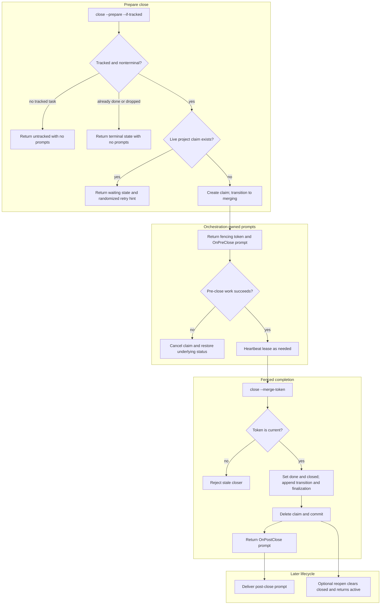

# Task Closing Flow

## Overview

This flow traces `close --prepare` through project merge-claim acquisition,
configured pre-close work, fenced completion, post-close work, and optional
reopen. It identifies which effects are transactional and which remain
orchestration-owned Codex prompts.

## Entry Points

- `skills/agtask/references/close.md:Close with OnPreClose and OnPostClose`
- `skills/agtask/scripts/agtask:command_close`
- `skills/agtask/scripts/agtask:claim_merge_slot`

## Sequence Diagram



## Execution Trace

### 1. Acquire the project merge claim

The orchestrating agent targets the real Codex session and asks the CLI to
prepare closure. The CLI resolves that selector to a logical task before
claiming the exact project.

#### 1.1 Prepare or wait

- `skills/agtask/scripts/agtask:command_close`

```ts
result := close(session_id, if_tracked=true, prepare=true)
if task is untracked or terminal
  return result_without_prompts
if another live project claim exists
  return waiting_with_jitter
token := claim_project(thread.id)
transition_status("merging")
```

Waiting happens outside SQLite. A claimant retries after jitter rather than
holding a database transaction open.

### 2. Run configured pre-close work

After the prepare transaction commits, the CLI returns the fencing token and
configured `OnPreClose` prompt as data. The Codex orchestration layer delivers
that prompt; the ledger process never executes it.

#### 2.1 Heartbeat or cancel the claim

- `skills/agtask/references/close.md:Close with OnPreClose and OnPostClose`

```ts
for each OnPreClose prompt
  result := run_as_agent_instruction(prompt)
  if result blocks or fails
    close(cancel=true, merge_token=token)
    stop
  close(heartbeat=true, merge_token=token)
```

Cancel deletes the claim and restores the latest saved underlying status.
Heartbeat extends only the matching unexpired lease.

### 3. Commit completion with fencing

Only the holder of the current token may complete the task. The final
transaction uses one timestamp for task closure and both history events.

#### 3.1 Finalize the task

- `skills/agtask/scripts/agtask:command_close`

```ts
begin_immediate()
require current_claim.token == supplied_token
thread.status := "done"
thread.updated := now
thread.closed := now
append_meta("status:merging->done")
append_meta("finalization:completed")
delete_project_claim()
commit()
```

A stale token cannot commit after cancellation, expiry takeover, or another
owner's claim.

### 4. Deliver post-close work

After commit, the result may contain one configured `OnPostClose` prompt. That
instruction cannot roll back the completed ledger state.

#### 4.1 Return the committed snapshot

- `skills/agtask/scripts/agtask:lifecycle_result`

```ts
result := committed_thread_snapshot()
if close transitioned to done
  result.hook_prompts := configured_on_post_close
else
  result.hook_prompts := []
return result
```

An idempotent already-terminal retry is token-free and prompt-free.

## Notes

- `OnPreClose` failure prevents the committing close. `OnPostClose` failure is
  reported as incomplete follow-up but does not reopen the task.
- Merge claims are owned by logical `thread.id`; the command may enter through
  either logical `--id` or Codex `--session-id`.
- Ordinary turns received during `merging` update the claim's underlying status
  so cancellation restores the latest lifecycle state.
- `reopen` is the only operation that changes `done` or `drop` back to
  `active`; it clears `closed` and records a new transition. A later close
  creates a new finalization pair.
- Prompt strings are data crossing from the CLI to orchestration. They are never
  shell commands.

## Observability

Metrics:
- None identified.

Logs:
- Explicit close failures and stale-token errors are printed by the CLI.
- JSON prepare results expose `status`, the merge token, waiting/retry data, and
  configured prompt metadata.

## Related docs

- [Rollout updates](rollout-updates.md)
- [Flow index](README.md)
- [Architecture](../ARCHITECTURE.md)
- [Data model](../data_model.md)
- [CLI reference](../CLI.md)

## Manual Notes

[keep this for the user to add notes. do not change between edits]

## Changelog
- 2026-07-21 10:07: Split project-serialized close preparation and finalization into a dedicated runtime flow (019f6e7b-6fee-7b22-9ee7-0448a1431036 - d0ab5633f6fc478e631614a90bf4c7e2054faafa)
