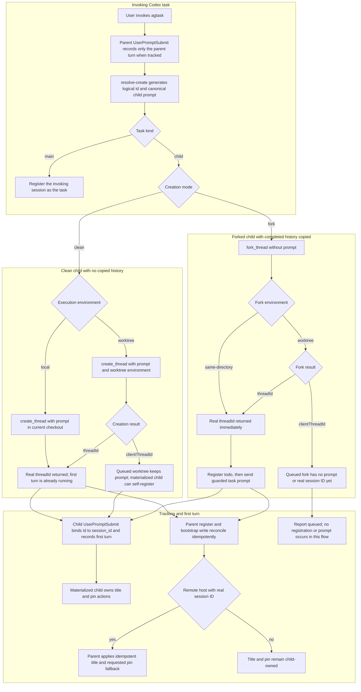

# Task Creation Flow

## Overview

This flow explains how `$agtask` designates the current task or creates one
child task. It distinguishes a clean child from a fork, and a regular
same-checkout child from a child whose Git worktree must be materialized before
its real Codex session ID exists.

## Entry Points

The flow starts when a user invokes `$agtask`. If the parent task is already
tracked, its own `UserPromptSubmit` hook records that invocation as a parent
rollout; it does not create the child row.

- `skills/agtask/references/create.md:Select designation or creation`
- `skills/agtask/scripts/agtask:command_resolve_create`
- `skills/agtask/scripts/agtask:handle_hook`

## Sequence Diagram



## Execution Trace

### 1. Resolve one creation attempt

The parent resolves task kind, clean-or-fork mode, environment, title, model,
pin policy, project, and one logical creation ID before calling a Codex task
tool. That ID is reused for every registration and bootstrap write in this
attempt.

#### 1.1 Generate the logical ID and child trailer

- `skills/agtask/scripts/agtask:command_resolve_create`

```ts
resolved := merge_defaults_and_explicit_inputs()
creation_id := uuid_v4()
if resolved.kind == "child"
  prompt := task_text + configured_on_create + canonical_v2_trailer(creation_id)
return resolved + creation_id + prompt_inputs
```

For `kind=main`, the resolver ID identifies the current task's ledger row, but
the child-only environment, model, and bootstrap values are inert.

### 2. Create the default clean child

The default path calls `create_thread` with the complete prompt. A regular
creation passes the local environment and runs in the current checkout. A
worktree creation passes the worktree environment and asks Codex to prepare an
isolated Git checkout for the child.

#### 2.1 Submit the clean prompt

- `skills/agtask/references/create.md:Child clean mode`

```ts
result := create_thread(
  prompt=clean_prompt_with_final_v2_trailer,
  target.environment=resolved.environment,
  model=resolved.model_when_explicit,
)
if result.threadId exists
  session_id := result.threadId
else
  report queued clientThreadId
```

On the current Codex surface, clean creation is one-shot: `prompt` is required,
so the first child turn may start before the parent receives `threadId`.

### 3. Bind the child when its first prompt runs

The real child's `UserPromptSubmit` hook receives the final bootstrap trailer
and the real Codex `session_id`. It inserts or verifies the logical
`id -> session_id` pair and records the first user rollout in one transaction.

#### 3.1 Register from the real child hook

- `skills/agtask/scripts/agtask:handle_hook`

```ts
begin_immediate()
if id and session_id are unclaimed
  insert_thread(id, session_id, parent_session_id, status="active")
else if stored_pair != requested_pair
  rollback_and_emit_nothing()
record_real_user_turn(thread_id=id)
commit()
```

A clean worktree operation that initially returns only `clientThreadId` still
owns the submitted prompt. When Codex materializes that child and submits its
first turn, this hook can self-register it without parent polling.

### 4. Reconcile from the parent

When clean creation returns a real `threadId`, the parent registers the same
pair and records the byte-identical prompt with reserved turn ID `bootstrap`.
These writes repair either parent-first or hook-first timing without creating a
second row or initial user rollout.

#### 4.1 Verify the returned child

- `skills/agtask/references/create.md:Verify write results`

```ts
register(
  id=creation_id,
  session_id=threadId,
  initial_prompt=prompt,
  authoritative_session=true,
)
record_turn(thread_id=creation_id, role="user", turn_id="bootstrap", content=prompt)
require one thread row and one initial user rollout
return codex_deep_link(threadId)
```

The parent does not wait for deferred child-owned title and pin actions. When
the child is remote and creation returned a real Codex session ID, the parent
also applies the same title and requested pin as an idempotent reliability
fallback before returning. Local children normally leave both actions to the
child. If authoritative one-shot registration displaces a copied helper
session, the parent applies the same fallback locally because the real child
did not receive bootstrap action context.

## Notes

### Creation path comparison

| Path | Codex operation | Conversation context | Checkout | Prompt timing | Initial ledger behavior |
| --- | --- | --- | --- | --- | --- |
| Main designation | No create or fork call | Current task remains current | Current checkout | No child prompt | Register current session `active` with null parent |
| Regular clean child | `create_thread(prompt, local)` | New task; no copied history | Current checkout | Prompt is part of creation | Child hook may bind first; parent reconciles when `threadId` returns |
| Clean worktree child | `create_thread(prompt, worktree)` | New task; no copied history | New Codex-managed Git worktree | Prompt is attached before worktree materialization | A real `threadId` follows immediately or `clientThreadId` reports queued; queued child can self-register from the attached prompt |
| Same-directory fork | `fork_thread(same-directory)`, then `send_message_to_thread` | Copies completed parent history | Current checkout | Prompt is sent only after fork returns `threadId` | Parent registers `todo` before sending; child hook activates it |
| Worktree fork | `fork_thread(worktree)`, then message only after `threadId` exists | Copies completed parent history | New Codex-managed Git worktree | `fork_thread` carries no prompt | A queued `clientThreadId` is not registerable or messageable; the current agtask flow reports queued and stops before registration |

### Clean child versus fork

- Clean creation starts a new conversation. The child sees only its task prompt,
  configured `OnCreate` instruction, bootstrap trailer, and repository context.
- Forking copies completed conversation history from the source task. An active
  unfinished turn is not copied.
- The fork prompt begins with a guard stating that the new task is the sole
  current instruction and copied history is background.
- `create_thread` requires the prompt, so clean creation is hook-first capable.
  `fork_thread` accepts no prompt, so a real same-directory fork can be
  registered `todo` before `send_message_to_thread` starts its first new turn.

### Regular checkout versus worktree

- `worktree=false` selects `local` for clean creation and `same-directory` for
  fork creation. Both reuse the source checkout.
- `worktree=true` asks Codex to create a separate Git worktree. Setup may be
  asynchronous and return `clientThreadId` before the child has a real
  `threadId`.
- `clientThreadId` is never stored as `thread.session_id`, used in a Codex deep
  link, or passed to agtask registration.
- A queued clean worktree has already received its prompt and can self-register
  when materialized. A queued worktree fork has not received a prompt, so it
  cannot use bootstrap self-registration at that point.

### Identity and ordering constraints

- Child registration uses the invoking Codex session as immutable
  `parent_session_id`; the parent need not itself be tracked.
- The hook remains first-writer-wins because it cannot distinguish the primary
  child from a copied internal title-generation prompt.
- One-shot parent registration uses `--authoritative-session`, treating the
  `create_thread` result as canonical. When a copied helper bound the logical
  ID first, the CLI verifies the provisional row shape, rebinds the logical ID,
  removes copied helper rollouts, and reports `session_rebound_from`.
- Ordinary registration and hook conflicts remain strict; titles, timing, and
  UUID ordering are never used to choose the canonical session.

### Remote-host title and pin fallback

- A remote child with a real Codex session ID (`threadId` in the creation
  result) receives a parent-side title and requested-pin fallback before the
  parent returns.
- The version-2 child actions remain enabled. If the remote host has the agtask
  hook, the child may repeat the same app actions safely because both setters
  are idempotent.
- A queued `clientThreadId` or worktree ID is not a Codex session ID, so the
  parent cannot target either app action. A queued clean child retains those
  actions in its submitted prompt; a queued fork has no submitted prompt yet.

## Observability

Metrics:
- None identified.

Logs:
- Parent orchestration reports `created; tracking pending`, verified, partial,
  or queued state. For a remote child with a real session ID, it also reports
  the direct parent fallback result for title and pin.
- Explicit registration errors are printed by the agtask CLI. Hook-side
  malformed or conflicting bootstraps intentionally remain silent.

## Related docs

- [Session identity binding](session-identity-binding.md)
- [Flow index](README.md)
- [Architecture](../ARCHITECTURE.md)
- [Data model](../data_model.md)
- [CLI reference](../CLI.md)

## Manual Notes

[keep this for the user to add notes. do not change between edits]

## Changelog
- 2026-07-21 10:21: Added remote-host title and pin fallback while preserving child-owned actions and queued-client behavior (019f6e7b-6fee-7b22-9ee7-0448a1431036 - b026a6e)
- 2026-07-21 10:07: Split task creation into a dedicated flow and distinguished regular clean, clean worktree, same-directory fork, and worktree-fork behavior (019f6e7b-6fee-7b22-9ee7-0448a1431036 - d0ab5633f6fc478e631614a90bf4c7e2054faafa)
