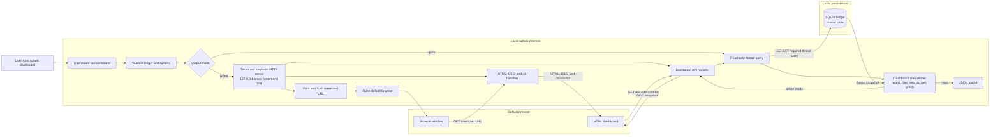

# Feature Spec: agtask Dashboard

**Date:** 2026-07-16
**Status:** Complete

---

## TL;DR

- Add `agtask dashboard`, which validates the local ledger, starts a tokenized loopback-only HTTP server, and opens an HTML dashboard in the default browser.
- Group every tracked task across every project by status, with interactive project/parent/status filters, title search, and created/updated/closed sorting.
- Keep the server read-only, dependency-free, and local: in-memory HTML/CSS/JS assets, a fresh SQLite snapshot per API request, no remote bind, and no schema change.
- Prove browser-launch fallback, HTTP security boundaries, API semantics, HTML structure, clean shutdown, installed-runtime parity, and no-ledger-mutation behavior.

---

## Goal and Scope

### Goal

Give users a browser-based local overview of all tracked Codex tasks without requiring repeated `list` and `search` calls. A bare `agtask dashboard` should open an HTML table grouped by status and provide interactive filters, sorting, and title search.

### In Scope

- Add a `dashboard` subcommand to the bundled CLI.
- Bind an ephemeral port on `127.0.0.1`, print the tokenized URL, open it in the default browser, and serve until interrupted.
- Serve HTML, CSS, and JavaScript from in-memory standard-library handlers; do not require a build step or external assets.
- Show tasks from every stored project by default, with no current-directory project filter and no implicit row limit.
- Group rows by `todo`, `active`, `blocked`, and `done`.
- Display title, project, parent task ID, created, updated, and closed values.
- Filter by one or more projects, parent task IDs (including root tasks with no parent), and statuses.
- Sort within status groups by `created`, `updated`, or `closed`, in ascending or descending order.
- Search titles with a case-insensitive literal substring.
- Provide a manual refresh that reads a fresh ledger snapshot without losing the current controls.
- Retain `--json` as a non-browser automation and test boundary over the same dashboard view model.
- Update CLI documentation, architecture/data-model query documentation, installed skill guidance, tests, and the versioned integration scenario bundle.

### Out of Scope

- Binding to non-loopback interfaces, remote access, multi-user hosting, TLS, or durable authentication.
- Editing task status, title, project, lineage, or any other ledger state from the dashboard.
- Opening, forking, or navigating to Codex tasks from a row.
- Background polling, push updates, saved views, or persisted dashboard preferences.
- Searching descriptions or rollout messages; the existing `search` command retains its title-and-description FTS behavior.
- Third-party frontend/server frameworks, package-manager dependencies, external fonts/assets, or a frontend build pipeline.
- New SQLite columns, indexes, tables, triggers, migrations, or a schema-version bump.

---

## Context

### Background

The version-3 ledger already stores the fields needed for a cross-project dashboard: immutable project and parent lineage, current status, title, and created/updated/closed timestamps. The current `list` command can filter one status and returns at most 50 rows ordered by recent updates; the current `search` command uses FTS over both title and description. Neither command provides an interactive grouped HTML view or combined filters.

### Current State

- `agtask` is a standalone Python-standard-library script installed as part of the skill package.
- `thread` has the current-state columns needed by the dashboard. Status is constrained to `todo`, `active`, `blocked`, or `done`; only done rows have `closed` set.
- `list` optionally filters one status, orders by `updated DESC, created DESC`, and applies a default limit of 50.
- `search` performs a literal FTS match across title and description, ranks by BM25, and applies a default limit of 20.
- The CLI has no HTTP server or HTML output today.
- Existing explicit CLI reads fail closed on missing, unsafe, or incompatible ledgers. Hook-only fail-open behavior does not apply to dashboard startup.

### Related

- [CLI implementation](../../skills/agtask/scripts/agtask): parser, schema verification, database opening, current list/search queries, emit helpers, and the implementation seam for the dashboard server.
- [Data model](../data_model.md): authoritative thread fields, status/closed invariant, indexes, timestamp behavior, and existing query semantics.
- [Architecture](../ARCHITECTURE.md): Python-standard-library constraint, CLI ownership, database failure behavior, and source/runtime layout.
- [Skill workflow](../../skills/agtask/SKILL.md): administrative command inventory exposed from the installed skill.
- [CLI tests](../../tests/test_cli.py): subprocess fixture, isolated `AGTASK_DB`, schema assertions, and current list/search coverage.
- [Integration scenarios](../../.agents/skills/integ/references/scenarios.md): versioned live proof contract that must gain dashboard coverage because this is major functionality.
- [README](../../README.md): public install, CLI, test, and recovery documentation.

### Constraints

- Preserve schema version 3 and the existing thread/rollout persistence contract.
- Use only Python standard-library facilities in the runtime package: `http.server`, `secrets`, `urllib.parse`, `webbrowser`, SQLite, and existing helpers.
- Bind only to numeric loopback address `127.0.0.1`; expose no host override.
- Keep the default ledger at `~/.llm/agtask/ledger.db` and retain `AGTASK_DB` for isolated tests.
- Open and close a database connection per API snapshot; perform no inserts, updates, deletes, status transitions, or rollout writes.
- Treat stored RFC 3339 UTC timestamps as the display and sort source of truth.
- Preserve the repository as canonical and verify the installed `skillz` runtime byte-for-byte after implementation.

---

## Approach and Touchpoints

### Proposed Approach

Implement the feature in three layers inside the bundled CLI:

1. A dashboard view-model layer loads the required `thread` columns, derives global facets, applies validated filters and title search, performs deterministic sorting, and returns ordered status groups.
2. A loopback HTTP layer serves in-memory HTML/CSS/JS and a tokenized read-only JSON endpoint. Each API request obtains a fresh view-model snapshot.
3. A browser layer renders semantic HTML tables and sends filter, sort, search, and refresh state to the API. Task values enter the DOM only through text nodes.

#### Architecture



The HTTP server never writes the ledger and never serves task values inside executable markup. Startup validates before binding, then publishes the URL before attempting browser launch. The browser receives a static application shell and obtains escaped JSON through the API response path. `dashboard --json` bypasses browser/server startup and serializes the same view model directly to stdout.

### CLI Contract

```text
agtask dashboard
  [--project PROJECT]...
  [--parent-thread-id THREAD_ID]...
  [--root-parent]
  [--status todo|active|blocked|done]...
  [--sort created|updated|closed]
  [--direction asc|desc]
  [--search TEXT]
  [--no-open]
  [--json]
```

Filter flags are repeatable and seed the browser’s initial controls. Repeated values within one dimension are ORed; project, parent, status, and title-search dimensions are ANDed. `--root-parent` includes rows whose `parent_thread_id` is null and is ORed with explicit parent IDs. An omitted dimension means all values. The CLI retains `--parent-thread-id` to match existing vocabulary, while the HTML labels the column “Parent task.”

Validated CLI state is encoded with `urllib.parse.urlencode(..., doseq=True)` into the opened page URL using these exact parameters and order: repeated `project`, repeated `parent_thread_id`, optional `root_parent=1`, repeated `status`, singleton `sort`, singleton `direction`, and singleton `search`. Defaults are omitted (`sort=updated`, `direction=desc`, empty search, and unfiltered dimensions). Browser chips and toolbar controls write the same canonical query string with `history.replaceState`; page reload reads it back before the first API request.

The page forwards those parameters unchanged to `/<token>/api/dashboard`. Unknown parameters, empty project/parent/status values, duplicate singleton parameters, `root_parent` values other than `1`, invalid statuses/sort fields/directions, and malformed percent encoding return `400`. `search=` is accepted and normalized to no search filter.

`--no-open` starts the same server and prints its URL without calling `webbrowser.open`; it supports tests, remote-less shells, and manual browser selection. `--json` emits one grouped snapshot and exits without binding a port. Combining `--json` and `--no-open` is rejected because no server exists in JSON mode.

### Server Lifecycle and HTTP Contract

1. Validate all command options and complete one ledger snapshot before binding or opening a browser. Missing, unsafe, locked, or incompatible ledgers fail through the existing explicit-command error path.
2. Generate at least 256 bits of entropy with `secrets.token_urlsafe`, configure `ThreadingHTTPServer` with `daemon_threads = True` and `block_on_close = False`, bind `127.0.0.1` on port `0`, and construct `http://127.0.0.1:<port>/<token>/` plus the canonical initial query string.
3. Print the URL to stdout and flush it before browser launch so `--no-open` subprocesses can consume it immediately. Unless `--no-open` is set, call `webbrowser.open`; a false return or exception emits a warning to stderr while the server continues for manual opening.
4. Serve in the foreground until `Ctrl-C`. Interrupt stops acceptance, closes the listening socket without waiting indefinitely for daemon request threads, and exits successfully. Handlers accept no request body and complete bounded in-memory or SQLite-read work. Closing the browser does not implicitly stop the server.

Allowed tokenized routes are:

| Method and path | Response |
| --- | --- |
| `GET`/`HEAD /<token>/` | HTML application shell. |
| `GET`/`HEAD /<token>/app.css` | In-memory dashboard stylesheet. |
| `GET`/`HEAD /<token>/app.js` | In-memory dashboard controller. |
| `GET`/`HEAD /<token>/api/dashboard` | Fresh grouped JSON snapshot using validated repeated query parameters. |

Every other path returns `404`; non-`GET`/`HEAD` methods return `405`. Requests with a `Host` value other than the exact bound `127.0.0.1:<port>` return `404`. The server provides no directory listing, file reads, upload, mutation, or command execution route.

Successful responses use exact media types: `text/html; charset=utf-8`, `text/css; charset=utf-8`, `text/javascript; charset=utf-8`, and `application/json; charset=utf-8`. `HEAD` returns the corresponding GET headers and content length with no body. Error JSON also uses `application/json; charset=utf-8`.

All responses set `Cache-Control: no-store`, `Referrer-Policy: no-referrer`, and `X-Content-Type-Options: nosniff`. HTML also sets a restrictive Content Security Policy: `default-src 'none'; style-src 'self'; script-src 'self'; connect-src 'self'; img-src 'self' data:; base-uri 'none'; form-action 'none'; frame-ancestors 'none'`. Assets make no network requests outside the tokenized loopback origin.

Override `BaseHTTPRequestHandler.log_message` so the default access log never writes the token, request path, query string, task title, or filter value. Normal requests are not logged. Startup, browser-launch warnings, and internal failures use explicit sanitized stderr messages that omit the tokenized URL and user-controlled query values.

Invalid API parameters return `400` JSON without a partial snapshot. If the ledger becomes unavailable or incompatible after startup, the API returns `503` JSON, logs the actionable detail to stderr, and the page retains its last successful data with an error banner.

### HTML Dashboard Contract

- Render a responsive page with a header, visible/total counts, title-search input, sort field, direction control, refresh button, a right-aligned **Add filter** trigger, an active-filter bar, and fixed-order status sections.
- The filter trigger opens a registry-driven field menu for project, parent task, and status. Choosing a field opens its value view; active fields and values are visibly marked. Choosing a value toggles it, updates results immediately, and dismisses the menu. The filter-bar plus button opens the same field menu.
- Render one compact segmented chip per active field in `Field | operator | value | remove` order. A field with several selected values uses `is any of` and joins values with `or`. Removing a chip clears that entire dimension and updates results immediately.
- Status sections appear as `todo`, `active`, `blocked`, `done`. With no status filter, all four sections appear, including zero-count groups. With a status filter, only selected groups appear, in canonical order.
- Each section renders a semantic table with `Title`, `Project`, `Parent task`, `Created`, `Updated`, and `Closed`. Narrow layouts may hide timestamp/parent columns with CSS, but values remain in the API snapshot.
- Each title is a keyboard-accessible `codex://threads/<task-id>` deep link that opens the task in the Codex app. The task ID is encoded as one URL path segment before `href` assignment.
- Stored timestamps display in UTC as `YYYY-MM-DD HH:MMZ`; missing parent and closed values display as `—`.
- Search is debounced briefly; filter, chip removal, and sort changes request a new API snapshot immediately. The manual refresh reuses current controls. There is no background polling.
- Controls update the page query string with `history.replaceState` so current view state survives browser refresh for the lifetime of the tokenized server URL.
- Render visible task data with `textContent`/text nodes only; never concatenate task values into `innerHTML`, CSS, or script. The only task-derived URL is the encoded Codex title deep link.
- Use labeled controls, semantic headings/tables, visible focus, and an `aria-live` status/error region. Filter buttons expose their popup state; Arrow Up/Down and Home/End navigate menu items; Enter/Space activate the focused button; Escape dismisses and restores focus to the opener; Arrow Left returns from values to fields; Tab and outside pointer actions dismiss predictably.
- On narrow layouts, wrap the toolbar and chips, keep the plus action visible, contain the dropdown within the viewport, and use a single field/value panel with an explicit Back action.
- Distinguish an empty ledger from zero matching results. The empty-ledger callout offers refresh; the no-results callout offers to clear filters and title search.
- Use an embedded neutral visual system inspired by Linear’s compact table hierarchy; do not copy proprietary assets or require external fonts.

### Search, Sort, and Grouping Semantics

- Title search compares `query.casefold()` with `thread.title.casefold()` as a literal substring. Empty or omitted search text applies no search filter. It never parses FTS syntax or matches description/rollout text.
- The default sort is `updated desc` and applies within each status group. Status group order never changes with row sort.
- The selected timestamp and direction are the primary key. Null primary values always sort last. Ties use `updated DESC`, then `created DESC`, then `id ASC` for deterministic output.
- Because the schema guarantees `closed` only for done tasks, `closed` sorting orders the done group. Non-done groups contain only null closed values and therefore use the tie-break order.
- Filtering and sorting operate over every `thread` row; dashboard does not inherit `list` limits or BM25 ranking.
- Facets are derived from the unfiltered snapshot so controls do not lose available values as filters narrow the visible groups.

### JSON Snapshot Contract

The tokenized API and `dashboard --json` return the same shape:

```json
{
  "filters": {
    "projects": [],
    "parent_thread_ids": [],
    "include_root": false,
    "statuses": []
  },
  "search": "",
  "sort": {"field": "updated", "direction": "desc"},
  "total_count": 0,
  "visible_count": 0,
  "facets": {
    "projects": [],
    "parents": [],
    "statuses": [
      {"value": "todo", "count": 0},
      {"value": "active", "count": 0},
      {"value": "blocked", "count": 0},
      {"value": "done", "count": 0}
    ]
  },
  "groups": [
    {"status": "todo", "count": 0, "threads": []},
    {"status": "active", "count": 0, "threads": []},
    {"status": "blocked", "count": 0, "threads": []},
    {"status": "done", "count": 0, "threads": []}
  ]
}
```

Project facets contain `{value, count}`. Parent facets contain `{value, count}`, where `value: null` represents root tasks. Facet counts describe the complete unfiltered snapshot. Filter and facet arrays are deduplicated by exact value and emitted in deterministic `(casefold, original value)` order; status arrays use lifecycle order.

Every `threads` entry contains only the fields consumed by the page: `id`, `parent_thread_id`, `project`, `title`, `created`, `updated`, `closed`, and `status`. It contains no description, kind, rollouts, HTML, or formatted timestamps.

### Integration Points / Touchpoints

- [`skills/agtask/scripts/agtask`](../../skills/agtask/scripts/agtask): add parser wiring, view-model/facet helpers, HTML/CSS/JS constants, tokenized loopback server, security headers, browser launch, and clean shutdown.
- [`tests/test_cli.py`](../../tests/test_cli.py): extend parser/help and isolated-ledger command coverage while preserving current list/search expectations.
- `tests/test_dashboard.py`: add focused subprocess and HTTP tests; do not import the extensionless executable as a module.
- [`skills/agtask/SKILL.md`](../../skills/agtask/SKILL.md): list `dashboard` among administrative query commands.
- [`README.md`](../../README.md): document browser launch, `--no-open`, controls, shutdown, loopback security, and JSON usage.
- [`docs/ARCHITECTURE.md`](../ARCHITECTURE.md): add the read-only local HTTP/browser boundary to CLI ownership and source/runtime layout.
- [`docs/data_model.md`](../data_model.md): document dashboard snapshot, facet, filter, grouping, and sort/search semantics without changing the schema contract.
- [`.agents/skills/integ/references/scenarios.md`](../../.agents/skills/integ/references/scenarios.md) and bundled assertions: bump the suite version, add a dashboard scenario, and retain proof under `.integ/proof/<n>`.

### Resolved Ambiguities / Decisions

- HTML delivery uses a loopback server opened in the default browser; it does not print markup or persist an HTML file.
- The server uses an ephemeral port and tokenized path, binds only `127.0.0.1`, and exposes no host override.
- Browser filters call a server-owned view model, keeping HTML behavior and `--json` semantics aligned.
- “Across all your projects” means every project in the configured ledger, not the current working directory’s project.
- “Parent task ID” maps to `parent_thread_id`; no alias field or migration is introduced.
- One browser chip represents one multi-value filter dimension. Values within a chip/dimension are ORed; chips/dimensions and title search are ANDed.
- Search is a case-insensitive literal title substring. Reusing current search unchanged would incorrectly include descriptions and impose FTS phrase/ranking semantics.
- Sort changes row order inside fixed status groups; it does not reorder status groups.
- Manual refresh is included; background polling and persisted view state are deferred.
- JSON remains the stable machine-readable contract, while HTML/DOM structure is the human interface.

### Existing Contract Snapshot

| Surface | Current owner / source of truth | Current fields, states, or shape | Current consumers |
| --- | --- | --- | --- |
| Thread rows | `thread` schema in the bundled CLI | Ten fields; status is `todo`, `active`, `blocked`, or `done`; `closed` is set exactly for done | `show`, `list`, `search`, hooks, `$fin` |
| `list` CLI | `command_list` | Optional single-status filter; `updated DESC, created DESC`; default limit 50; flat list | Users and CLI tests |
| `search` CLI | `command_search` and `thread_fts` | Literal FTS phrase over title and description; BM25 then updated; default limit 20 | Users and CLI tests |
| Query JSON | `emit` plus each command | Flat thread dictionaries for list/search; full thread plus rollouts for show/write commands | Scripts, skill verification, tests |
| HTTP/HTML | No current owner or surface | No server, routes, browser launch, or security-header contract | New dashboard only |
| Runtime packaging | Repository `skills/agtask` mirrored by `skillz` | Standalone standard-library Python and byte-for-byte source/runtime verification | Installed Codex skill |

### Target Decision Table

| Input facts / state | Target output | Notes |
| --- | --- | --- |
| Valid bare invocation | Tokenized loopback URL is printed, opened, and served until interrupt | Default browser receives HTML, not terminal markup. |
| CLI filters/sort/search are supplied | Canonically encoded page query initializes controls and first API request | Repeated values and defaults follow the CLI/URL contract. |
| `--no-open` | Same server and printed URL without browser launch | Deterministic test/headless path. |
| `--json` | One grouped JSON snapshot, then exit | No socket or browser side effect. |
| No filters or search | Four status groups containing every ledger thread | No project or row-limit default is applied. |
| Multiple values in one filter chip | A row matches any selected exact field value | OR within the chip/dimension; the chip uses `is any of`. |
| Multiple active field chips | A row must satisfy every active field chip and title search | AND across chips/dimensions. |
| Toolbar trigger or filter-bar plus | Open the same field-discovery dropdown | Active fields show counts; choosing one leads to its value view. |
| Chip remove action | Clear that field and refresh immediately | Other chips, search, and sort remain unchanged. |
| Root parent selected | Rows with `parent_thread_id IS NULL` are included | Can combine with explicit parent IDs. |
| Sort field is `closed` | Done rows use closed time and non-done rows use fallback order | Nulls are always last and output is deterministic. |
| Browser requests refresh | Fresh snapshot with current controls | No background polling or ledger write. |
| Invalid token, Host, route, or method | `404` or `405` without task data | Keep the loopback surface narrow. |
| Ledger becomes unavailable after startup | API returns `503`; page retains last snapshot and shows an error | Actionable details go only to stderr. |
| Browser launch fails | URL remains printed and server continues | User can open it manually. |

### Minimal Model Check

- New persisted fields/types/states: none.
- New transient types: server token/port, filter state, sort field/direction, facets, grouped snapshot, and page status/error state.
- Existing fields/types reused: eight consumed `thread` fields and the four existing statuses.
- Derived values intentionally not stored: token, URL, facet counts, visible counts, group membership, formatted timestamps, and search matches.
- Consumers for each transient type: the HTTP handlers, browser controls, `dashboard --json`, subprocess/HTTP tests, and integration assertions.
- Simpler alternative considered: generating an HTML file. It leaves sensitive derived data on disk and gives no clean manual-refresh path; an in-memory loopback server avoids both.

---

## Acceptance Criteria

- [x] `agtask dashboard` validates the ledger, binds only `127.0.0.1` on an ephemeral port, prints a tokenized URL, opens it in the default browser, and serves until clean interrupt.
- [x] The browser receives a functional HTML dashboard with a right-side project/parent/status filter dropdown, compact active-field chips, an adjacent plus button, title search, created/updated/closed sort and direction controls, manual refresh, and fixed lifecycle status groups.
- [x] Each title is an encoded Codex deep link that opens the corresponding task in the Codex app.
- [x] The default view contains every tracked project with no implicit project filter or row limit and sorts each group by `updated` descending.
- [x] Filters OR within a dimension and AND across dimensions; title search is case-insensitive, literal, title-only, and composable with every filter and sort.
- [x] Filter discovery, active indicators, value selection, chip removal, plus-button reuse, Escape/focus restoration, arrow-key navigation, narrow layouts, and empty/no-result states follow the documented interaction contract.
- [x] HTML/CSS/JS use no external assets, task values are inserted only as text, and the server enforces token, Host, method, route, media-type, CSP, no-store, no-referrer, nosniff, and access-log redaction boundaries.
- [x] CLI flags are canonically URL-encoded into the opened page, survive refresh, and produce the same validated API state; unknown, empty, malformed, duplicate-singleton, and invalid parameters return `400`.
- [x] `--no-open` exposes the same server without browser launch; browser-launch failure leaves a usable printed URL and running server.
- [x] `--json` emits the documented snapshot and exits without browser or socket side effects.
- [x] Manual refresh obtains a fresh ledger snapshot while preserving controls; API failure retains the previous view and shows an accessible error.
- [x] `Ctrl-C` closes the server and exits successfully without leaving a listener or temporary HTML artifact.
- [x] Running any dashboard path leaves thread and rollout contents unchanged and keeps schema version 3.
- [x] Existing `list`, `search`, lifecycle commands, hooks, and their JSON contracts remain unchanged.
- [x] Canonical and installed skill trees match, the versioned dashboard integration scenario passes, and its numbered proof directory is retained.

---

## Phases and Dependencies

### Phase 1: View Model and Snapshot Contract

- [x] Add parser options and validation for repeatable filters, root-parent selection, sort, direction, search, `--no-open`, and JSON mode.
- [x] Implement one all-thread read plus global facets and filter/search/sort/group helpers with deterministic ordering.
- [x] Implement the grouped JSON shape and subprocess tests for default, combined-filter, root, title-only, null-closed, tie, empty, facet, and Unicode-casefold cases.
- [x] Verify snapshot reads do not mutate thread/rollout contents or schema version.

### Phase 2: Tokenized HTML Server and Browser UI

- [x] Implement startup validation, secure token generation, loopback ephemeral bind, canonical query encoding, flushed URL printing, browser-launch fallback, `--no-open`, bounded threaded shutdown, and per-request database connections.
- [x] Implement the exact tokenized routes, method/Host checks, media types, response/security headers, suppressed default access logging, API errors, and fresh snapshot behavior.
- [x] Build the in-memory semantic HTML shell, responsive CSS, accessible registry-driven filter menu/chip bar/status region, and JavaScript fetch/render/query-state behavior.
- [x] Add subprocess/HTTP tests for HTML/assets, API queries, filter menu/chip/keyboard interactions, headers, token/Host/method rejection, browser-launch fallback, ledger failure, and clean listener shutdown.

### Phase 3: Product Integration and Proof

- [x] Update README, skill administrative commands, architecture, and data-model query documentation.
- [x] Add a versioned `dashboard-html` integration scenario and bundled assertions; bump the suite version because proof JSON/setup changes.
- [x] Sync the canonical skill into an isolated or installed runtime and verify source/runtime parity.
- [x] Run the full unit suite and `$integ`; retain `.integ/proof/<n>` as implementation evidence.

### Phase Dependencies

- Phase 2 depends on the Phase 1 snapshot contract so HTML and `--json` cannot diverge.
- Phase 3 documentation and integration assertions depend on the final CLI, route, security, HTML-control, JSON, and shutdown contracts.
- No schema migration, external service, non-loopback networking, or third-party runtime package is required.

---

## Validation Plan

Automated validation:

- Run `python3 -m unittest discover -s tests -v` for existing regression coverage and new dashboard cases.
- Exercise `dashboard --json` against isolated fixtures spanning every status, multiple projects and parents, a root task, equal timestamps, null/non-null closed values, mixed-case/Unicode titles, and descriptions that alone contain the query.
- Assert exact facets, group order, filter OR/AND composition, search scope, sort direction/null/tie behavior, counts, and the minimal eight-field thread projection.
- Start `dashboard --no-open` as a subprocess, read its flushed URL without waiting for process exit, fetch HTML/assets/API with the standard library, and terminate it with interrupt.
- Assert the semantic toolbar trigger, popup, active-filter region, plus action, labels, and ARIA relationships, and verify that task fixture values occur only in JSON responses—not HTML, CSS, or JavaScript assets.
- Execute the served JavaScript in the dependency-free Node harness to open the menu from both triggers, choose field values, compose multiple chips, remove a chip, exercise Arrow/Escape/focus behavior, and assert URL/query/result synchronization.
- Test CLI-to-URL encoding and page reload state; missing/wrong token; wrong Host; unknown routes; unsupported methods; unknown/empty/malformed/duplicate/invalid query parameters; exact content types and security headers; zero token/query access-log disclosure; browser-open failure; post-start ledger failure; simultaneous dashboard processes; and port release after shutdown.
- Compare thread and rollout rows plus `PRAGMA user_version` before and after HTML-server and JSON dashboard runs.
- Update the integration manifest and bundled assertions, then run the repository’s `$integ` workflow with the active parent thread ID. Retain the allocated `.integ/proof/<n>` directory.
- Run skill contract and installer tests and verify the installed `agtask` tree matches canonical source.

Manual validation:

- Run the default command and confirm it opens a polished local HTML dashboard in the default browser while printing the same URL in the terminal.
- Exercise every filter, root/child parent selection, multiple values in one chip, multiple field chips, chip removal, both add-filter triggers, title search, sort field/direction, manual refresh, browser refresh, empty/no-results states, and API-error banner.
- Verify wide and narrow responsive layouts, menu dismissal/focus restoration, arrow/Enter/Space/Escape behavior, visible focus, screen-reader status announcements, long/Unicode titles, and UTC/null rendering.
- Disable or break browser launching and confirm the printed URL remains usable; interrupt the command and confirm the page can no longer connect.
- Inspect browser developer tools to confirm no non-loopback requests, no cached task responses, and the expected CSP/security headers.

---

## Open Items and Risks

### Open Items

No blocking product or persistence questions remain. Exact visual spacing and colors may be tuned during implementation without changing the HTML, API, security, or interaction contracts.

### Risks and Mitigations

| Risk | Impact | Probability | Mitigation |
| --- | --- | --- | --- |
| A local web surface exposes task metadata unexpectedly | High | Low | Loopback-only bind, unguessable token path, exact Host validation, narrow GET routes, no-store/no-referrer, and no remote-host flag. |
| HTTP access logging leaks the bearer token or user search terms | High | Low | Disable the inherited request logger and allow only explicit sanitized lifecycle/error messages. |
| Task titles enable HTML/script injection | High | Medium | Keep data out of HTML/assets, JSON-encode responses, render with text nodes only, and enforce CSP. |
| Browser launch fails in headless or customized environments | Medium | Medium | Print URL before launch, provide `--no-open`, warn without stopping the server. |
| Server remains running after the browser closes | Low | High | Foreground lifecycle and explicit terminal guidance; `Ctrl-C` is authoritative shutdown. |
| API and browser control semantics drift | Medium | Low | Server owns filtering/sorting/grouping; browser only serializes controls and renders returned snapshots. |
| Repeated full-ledger snapshots become slow at large scale | Medium | Low | Keep transformations linear, refresh only on user action, benchmark a large fixture, and defer schema changes until a real threshold is observed. |
| Per-request database changes cause a stale or broken page | Medium | Medium | Fresh connection per snapshot; preserve last successful view and return accessible `503` errors. |

## Manual Notes 

[keep this for the user to add notes. do not change between edits]

## Changelog
- 2026-07-16 16:14: Created implementation-ready dashboard feature spec (019f6c88-3c37-7d20-983f-06233efc5226 - d0eb54ca7d8567a2def9f0a8aea065ee9ee4e68c)
- 2026-07-16 16:22: Added dashboard architecture diagram and clarified read/output boundaries (019f6c88-3c37-7d20-983f-06233efc5226 - d0eb54ca7d8567a2def9f0a8aea065ee9ee4e68c)
- 2026-07-16 16:31: Reworked dashboard output as a tokenized loopback-served HTML UI opened in the default browser (019f6c88-3c37-7d20-983f-06233efc5226 - e918fce148c69c8f4ce75fe3c66804aa718f5d0c)
- 2026-07-16 16:49: Implemented the HTML dashboard, automated coverage, documentation, and versioned integration scenario; installed-runtime parity and live proof remain pending due concurrent runtime drift (019f6c88-3c37-7d20-983f-06233efc5226 - e918fce148c69c8f4ce75fe3c66804aa718f5d0c)
- 2026-07-16 17:48: Made dashboard titles encoded Codex task deep links, extended the HTML integration contract, and synced the verified installed runtime (019f6c88-3c37-7d20-983f-06233efc5226 - e918fce148c69c8f4ce75fe3c66804aa718f5d0c)
- 2026-07-16 18:19: Reworked browser filtering around a right-side registry-driven dropdown, segmented field chips, adjacent plus action, keyboard navigation, responsive/empty states, served-JavaScript interaction coverage, and dashboard scenario v3 proof (019f6c78-fe8e-70b1-a747-2c987a1b61f2 - 595eddc9cef278ab3d005ba04be362168887a5f1)
- 2026-07-16 22:33: Marked the completed dashboard spec done after merging with master and validating suite v13/dashboard scenario v4 proof (019f6c78-fe8e-70b1-a747-2c987a1b61f2 - a7bfde1d67003fc92cd7b480a8c7ea065a4f2221)
