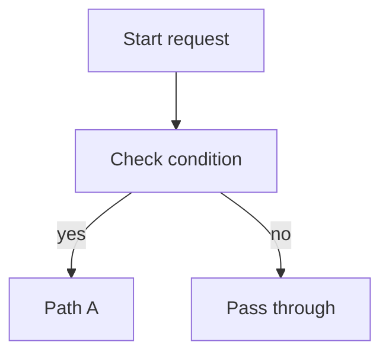

# Dev Diagram

## Overview

Construct diagrams that stay readable in their final destination. Support only two output formats: ASCII for plain-text readability and Mermaid for renderable Markdown.

## Choose The Format

1. Use ASCII when the user explicitly asks for ASCII, box art, or text diagrams.
2. Use ASCII when the destination is a terminal, plain Markdown fence, comment, note, or any medium that may not render Mermaid.
3. Use Mermaid when the user explicitly asks for Mermaid or when the destination is known to render Mermaid.
4. Preserve the existing format when updating an existing diagram unless the user asks to convert it.
5. Default to ASCII when the format is unspecified and render support is unclear.
6. Do not mix ASCII and Mermaid in one diagram block.

## Choose The Diagram Kind

1. Use a sequence diagram for actor-to-actor messages over time.
2. Use a flow diagram for ordered steps, branching, and control flow.
3. Use a state diagram for lifecycle transitions between named states.
4. Use a dependency or topology diagram for ownership, connectivity, or one-way coupling.
5. Use a decision tree when the point is rule evaluation rather than runtime sequencing.

## Build The Diagram

1. Identify the actors, systems, states, or steps before drawing.
2. Order the nodes in the direction the reader should scan.
3. Keep one abstraction level per diagram; split the diagram if system-level and code-level details are both needed.
4. Label an edge only when the action or condition is not obvious.
5. Prefer short box labels and move long explanation into surrounding prose.
6. Remove incidental helpers, retries, and logging unless they are part of the point of the diagram.
7. When updating an existing doc, replace only the diagram block and preserve nearby prose unless the user asks for more.

## Write ASCII Diagrams

1. Use plain ASCII only: `+`, `-`, `|`, `/`, `\`, `<`, `>`.
2. Keep the diagram valid in a monospaced font without relying on Unicode box-drawing characters.
3. Prefer top-to-bottom flow for pipelines and sequences.
4. Use side-by-side branches only when the full block stays readable within the document width.
5. Align box widths within a local cluster.
6. Put branch labels on the branch path, using concrete labels like `yes`, `no`, `enabled`, `disabled`, `true`, or `false`.
7. Use arrows and spacing consistently across the whole block.
8. Keep decorative art out of the diagram.

### ASCII Pattern

```text
+------------------+
| Start request    |
+------------------+
         |
         v
+------------------+
| Check condition  |
+------------------+
    | yes     | no
    v         v
+---------+ +--------------+
| Path A  | | Pass through |
+---------+ +--------------+
```

## Write Mermaid Diagrams

1. Use Mermaid only inside a `mermaid` fence.
2. Choose the smallest diagram type that fits:
   - `flowchart TD` for most flows
   - `sequenceDiagram` for actor/message sequences
   - `stateDiagram-v2` for state transitions
3. Keep node ids short and stable; put readable text in the label.
4. Always wrap node labels in double quotes when they contain parentheses, commas, arrows, function-like text, or other parser-sensitive punctuation.
5. Use the label form `A["label text here"]`, not `A[label text here]`.
6. `<br/>` is allowed inside quoted labels.
7. Decision nodes in `{}` may stay unquoted only when they contain simple words.
8. If unsure whether a label is safe, quote it anyway.
9. Prefer `flowchart TD` unless left-to-right materially improves readability.
10. Keep styling minimal unless the user explicitly asks for styling or visual emphasis.
11. Avoid dense cross-links that make the graph unreadable; split the diagram instead.
12. Treat Mermaid like a grammar parser, not Markdown; never rely on it to infer intent from punctuation.

### Mermaid Pattern



## Convert Between Formats

1. Preserve the same actors, decision points, and branch labels when converting between ASCII and Mermaid.
2. Simplify the layout when a literal one-to-one conversion would hurt readability.
3. Verify that the converted diagram still communicates the same control flow and outcomes.

## Final Checks

1. Ensure every box and edge serves a purpose.
2. Ensure directionality is obvious on first read.
3. Ensure labels use the vocabulary from the source material rather than invented system names.
4. Ensure the diagram reads cleanly in the target medium without extra explanation.
5. Emit one final diagram block unless the user explicitly asks for alternatives.
