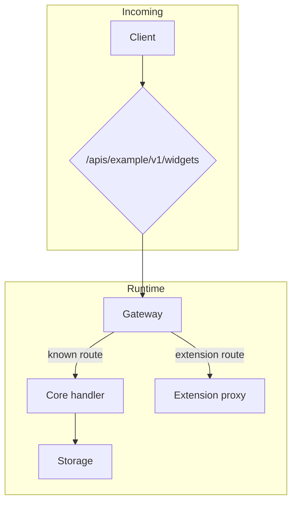
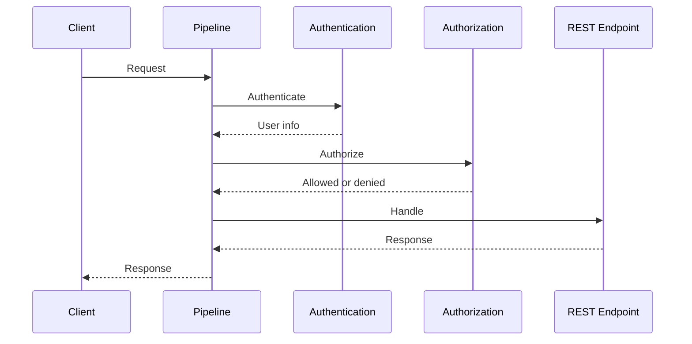
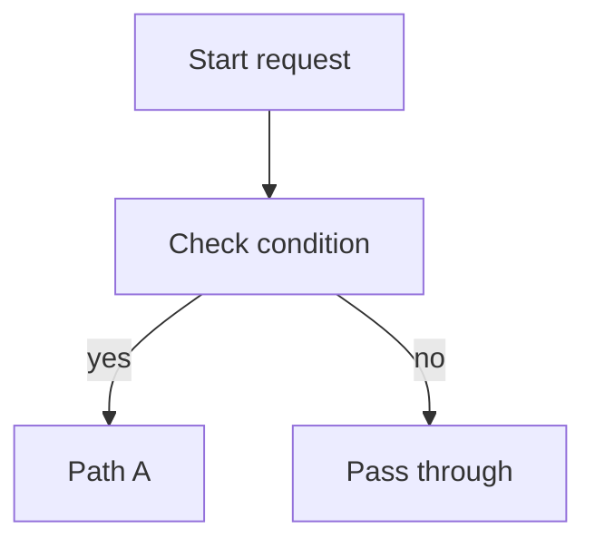

# Dev Diagram

## Overview

Construct diagrams that stay readable in their final destination. Support only two output formats: ASCII for plain-text readability and Mermaid for renderable Markdown.

## Invocation Shape

When the user invokes the skill with positional hints, treat them as:

```text
$dev.diagram [format] [diagram-kind]
```

Examples:

- `$dev.diagram mermaid general-flow`
- `$dev.diagram mermaid linear-flow`
- `$dev.diagram ascii decision-tree`

If the format and diagram kind conflict, follow the user's explicit format and adapt the kind to that format. If a named diagram kind is unknown, fall back to the closest kind in [Choose The Diagram Kind](#choose-the-diagram-kind).

## Choose The Format

1. Use ASCII when the user explicitly asks for ASCII, box art, or text diagrams.
2. Use ASCII when the destination is a terminal, plain Markdown fence, comment, note, or any medium that may not render Mermaid.
3. Use Mermaid when the user explicitly asks for Mermaid or when the destination is known to render Mermaid.
4. Preserve the existing format when updating an existing diagram unless the user asks to convert it.
5. Default to ASCII when the format is unspecified and render support is unclear.
6. Do not mix ASCII and Mermaid in one diagram block.

## Choose The Diagram Kind

1. Use `linear-flow` for one request or operation through ordered stages. In Mermaid, render it as `sequenceDiagram`.
2. Use `general-flow` for a call path with important branches grouped by components, ownership, or lifecycle boundaries. In Mermaid, render it as `graph TD`.
3. Use a sequence diagram for actor-to-actor messages over time when the user says `sequence` but not `linear-flow`.
4. Use a flow diagram for ordered steps, branching, and control flow.
5. Use a state diagram for lifecycle transitions between named states.
6. Use a dependency or topology diagram for ownership, connectivity, or one-way coupling.
7. Use a decision tree when the point is rule evaluation rather than runtime sequencing.

## Build The Diagram

1. Identify the actors, systems, states, or steps before drawing.
2. Order the nodes in the direction the reader should scan.
3. Keep one abstraction level per diagram; split the diagram if system-level and code-level details are both needed.
4. Label an edge only when the action or condition is not obvious.
5. Prefer short box labels and move long explanation into surrounding prose.
6. Remove incidental helpers, retries, and logging unless they are part of the point of the diagram.
7. When updating an existing doc, replace only the diagram block and preserve nearby prose unless the user asks for more.

## Write ASCII Diagrams

1. Use plain ASCII only: `+`, `-`, `|`, `/`, `\`, `<`, `>`.
2. Keep the diagram valid in a monospaced font without relying on Unicode box-drawing characters.
3. Prefer top-to-bottom flow for pipelines and sequences.
4. Use side-by-side branches only when the full block stays readable within the document width.
5. Align box widths within a local cluster.
6. Put branch labels on the branch path, using concrete labels like `yes`, `no`, `enabled`, `disabled`, `true`, or `false`.
7. Use arrows and spacing consistently across the whole block.
8. Keep decorative art out of the diagram.

### ASCII Pattern

```text
+------------------+
| Start request    |
+------------------+
         |
         v
+------------------+
| Check condition  |
+------------------+
    | yes     | no
    v         v
+---------+ +--------------+
| Path A  | | Pass through |
+---------+ +--------------+
```

## Write Mermaid Diagrams

1. Use Mermaid only inside a `mermaid` fence.
2. Choose the smallest diagram type that fits:
   - `graph TD` for `general-flow`
   - `sequenceDiagram` for `linear-flow` and actor/message sequences
   - `flowchart TD` for most other flows
   - `stateDiagram-v2` for state transitions
3. Keep node ids short and stable; put readable text in the label.
4. Always wrap node labels in double quotes when they contain parentheses, commas, arrows, function-like text, or other parser-sensitive punctuation.
5. Use the label form `A["label text here"]`, not `A[label text here]`.
6. `<br/>` is allowed inside quoted labels.
7. Decision nodes in `{}` may stay unquoted only when they contain simple words.
8. If unsure whether a label is safe, quote it anyway.
9. Prefer `flowchart TD` unless left-to-right materially improves readability.
10. Keep styling minimal unless the user explicitly asks for styling or visual emphasis.
11. Avoid dense cross-links that make the graph unreadable; split the diagram instead.
12. Treat Mermaid like a grammar parser, not Markdown; never rely on it to infer intent from punctuation.
13. For `sequenceDiagram`, keep participant ids syntax-safe and alphanumeric, such as `CreateHelper`, `ArchiveParser`, or `SkillClient`.
14. For `sequenceDiagram`, use readable aliases with `participant CreateHelper as Create helper`, then reference only the safe id in arrows.
15. Do not quote sequence message text just to protect punctuation. Prefer plain message text and simplify nested quotes, for example `version_no=1` instead of `version_no="1"`.

### Mermaid General-Flow Pattern

Use `general-flow` when the diagram should answer an architectural routing or composition question, such as "which component handles this request?" or "how does this configuration become runtime behavior?"

1. Pick one concrete request path, resource, or artifact as the running example.
2. Create 2-4 `subgraph` blocks for real component, ownership, or lifecycle boundaries.
3. Use source-grounded implementation names for nodes.
4. Put branch predicates on edges, not in surrounding prose.
5. Show the happy path plus only the important alternate routes.
6. End at meaningful sinks such as storage, handler, proxy, external service, or terminal state.
7. Explain source symbols in prose below the diagram instead of expanding every method in the diagram.



### Mermaid Linear-Flow Pattern

Use `linear-flow` when the diagram should answer an ordered processing question, such as "what stages does one request pass through?"

1. Pick exactly one request or operation.
2. Identify the client, coordinator, major semantic stages, and terminal endpoint.
3. Use 5-8 participants maximum.
4. For each stage, draw one request and one returned state or decision.
5. Preserve source-backed ordering invariants.
6. Collapse observability, timeout, tracing, logging, and bookkeeping wrappers unless they change the business flow.
7. Keep branches out unless the branch is the topic; encode secondary reject or deny cases in message labels.
8. Put code/package anchors in surrounding prose, not inside the diagram.



### Mermaid Basic Pattern



### Mermaid Validation

1. When editing Mermaid syntax, extract the fenced block to a real temporary file, for example `/tmp/diagram.mmd`.
2. Validate with `npx -y @mermaid-js/mermaid-cli -i /tmp/diagram.mmd -o /tmp/diagram.svg`.
3. Avoid process substitution as `mermaid-cli` input; it can fail on `/dev/fd/...` paths.
4. Treat a local preview server starting as a preview check, not a parser check. Use parser-backed validation before considering syntax fixed.

## Convert Between Formats

1. Preserve the same actors, decision points, and branch labels when converting between ASCII and Mermaid.
2. Simplify the layout when a literal one-to-one conversion would hurt readability.
3. Verify that the converted diagram still communicates the same control flow and outcomes.

## Final Checks

1. Ensure every box and edge serves a purpose.
2. Ensure directionality is obvious on first read.
3. Ensure labels use the vocabulary from the source material rather than invented system names.
4. Ensure the diagram reads cleanly in the target medium without extra explanation.
5. Emit one final diagram block unless the user explicitly asks for alternatives.
