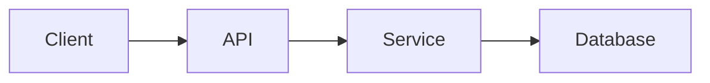

# Architecture Doc: [System Name]

**Last Updated**: YYYY-MM-DD

**Status**: [Draft | In Progress | Complete]

**Owners**: [Team / Maintainer]

**Related**:

- [Links to specs, design docs, ADRs, or runbooks]

* * *

## 0. Context

### Purpose

[What this system does and why it exists]

* * *

## 1. Scope

### In Scope

- [Responsibility]
- [Responsibility]

### Out of Scope

- [Non-goal]
- [Non-goal]

* * *

## 2. System Boundaries and External Dependencies

### Boundary Definition

[What this system owns vs what it delegates]

### External Systems

| Dependency | Purpose | Failure Impact |
| --- | --- | --- |
| [System] | [Reason] | [Impact] |

* * *

## 3. Architecture Overview

### High-Level Diagram (Required)

Use Mermaid or ASCII.

### Component Responsibilities

| Component | Responsibility | Key Interface |
| --- | --- | --- |
| [Component] | [Responsibility] | [Interface] |

### Primary Flows

1. [Flow step]
2. [Flow step]
3. [Flow step]

* * *

## 4. Interfaces and Contracts

### Internal Interfaces

- [Module/service interface and constraints]

### External Interfaces

- [API/event/queue contract and guarantees]

* * *

## 5. Data and State

### Source of Truth

[Where authoritative state lives]

### Data Lifecycle

[Creation, update, retention, deletion, archival]

### Consistency and Invariants

- [Invariant]
- [Invariant]

* * *

## 6. Reliability, Failure Modes, and Observability

### Reliability Expectations

[Latency/availability/error budget targets as applicable]

### Failure Modes

- [Failure mode + mitigation]
- [Failure mode + mitigation]

### Observability

- Metrics: [Key metrics]
- Logs: [Critical events]
- Traces: [Critical spans]

* * *

## 7. Security and Compliance

- Authentication and authorization model
- Sensitive data handling
- Compliance or policy constraints

* * *

## 8. Key Decisions and Tradeoffs

| Decision | Chosen Option | Alternatives Considered | Rationale |
| --- | --- | --- | --- |
| [Decision] | [Option] | [Alt A, Alt B] | [Why] |

* * *

## 9. Evolution Plan

### Near-Term Changes

- [Planned change]
- [Planned change]

### Long-Term Considerations

- [Potential future direction]

* * *

## 10. Risks and Open Questions

### Risks

- [Risk and impact]
- [Risk and impact]

### Open Questions

1. [Question]
2. [Question]

* * *

## References

- [Source 1]
- [Source 2]

## Manual Notes 

[keep this for the user to add notes. do not change between edits]

## Changelog
- [date]: [description of update] ([agent session id])
