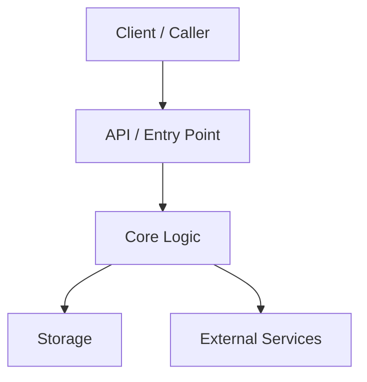
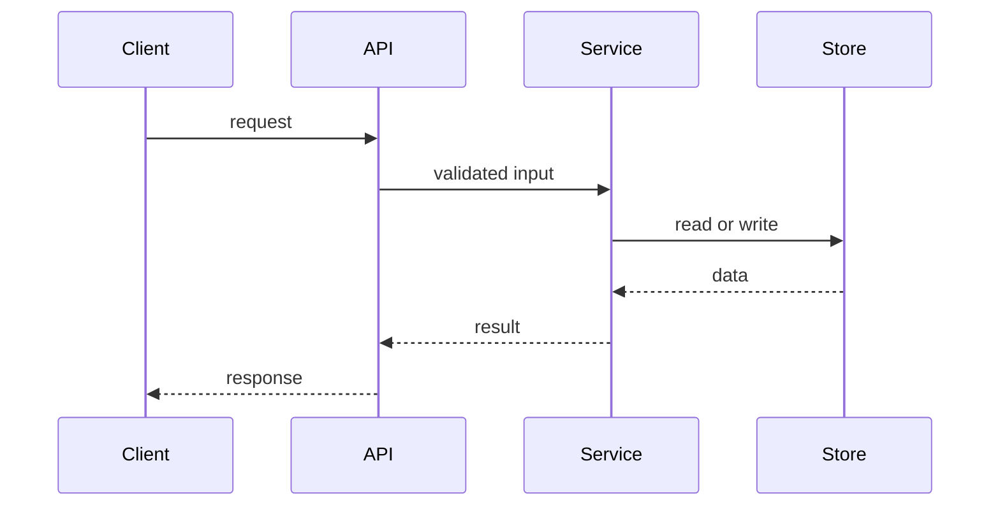
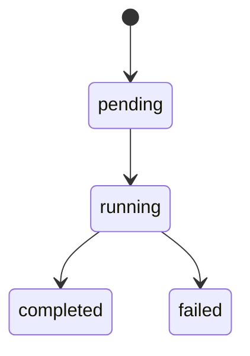

# Architecture

> High-level architecture, code organization, data flows, and key invariants for `PROJECT_NAME`.
> This document is for contributors making changes to the system.
> For setup and local development, see `README.md` and `CONTRIBUTING.md`.

## Who This Is For

Use this doc if you need to:
- understand the system before making changes
- find the right layer, module, or entry point to edit
- understand important boundaries and invariants
- avoid breaking architectural assumptions

## Scope

This document covers:
- the major components and how they fit together
- source code layout and ownership boundaries
- request, job, and data flow through the system
- architectural invariants and non-goals

This document does not cover:
- step-by-step setup
- API reference details
- end-user documentation

## System Overview

`PROJECT_NAME` is a `ONE_SENTENCE_DESCRIPTION`.

At a high level, the system consists of:
- `Component A`: purpose
- `Component B`: purpose
- `Component C`: purpose



## Goals

The architecture is optimized for:
- `Goal 1`
- `Goal 2`
- `Goal 3`

## Non-Goals

The architecture is explicitly not trying to:
- `Non-goal 1`
- `Non-goal 2`

## Entry Points

If you are new to the codebase, start here:
- `path/to/main_entry`: primary runtime entry point
- `path/to/request_or_job_dispatch`: request or job routing
- `path/to/core_api`: main internal API surface
- `path/to/tests_or_fixtures`: fastest way to see real usage

## Major Components

### `component-or-package-a`
- Purpose: what it does
- Lives in: `path/`
- Depends on: allowed dependencies
- Used by: callers or consumers
- Notes: important implementation detail

### `component-or-package-b`
- Purpose: what it does
- Lives in: `path/`
- Depends on: allowed dependencies
- Used by: callers or consumers

## Code Map

Key directories and what belongs in them:

| Path | Purpose | Notes |
|------|---------|-------|
| `src/...` | core business logic | no transport concerns |
| `api/...` | request handling or transport | thin layer only |
| `db/...` | persistence | no UI logic |
| `tests/...` | integration and end-to-end coverage | prefer real workflows |

## Layering Rules

Dependency direction should flow like this:

```text
interfaces -> orchestration -> domain/core -> persistence/integrations
```

Rules:
- lower layers must not import higher layers
- transport code must stay out of domain or core
- shared utilities must not become a grab-bag for feature logic
- cross-layer shortcuts require explicit justification

## Data / Request / Job Flow

Describe the main runtime path.

### Example: request lifecycle
1. request enters through `ENTRY_POINT`
2. auth or validation happens in `LAYER_OR_MODULE`
3. orchestration happens in `LAYER_OR_MODULE`
4. core logic computes result
5. persistence or external side effects happen
6. response or result is returned



## State Model

If the system has important entities, define them here.

### `EntityName`
- Represents: what it is
- Created by: where
- Updated by: where
- Persisted in: where

### State transitions


## Key Abstractions

Document the concepts contributors must understand.

| Abstraction | Location | Responsibility |
|------------|----------|----------------|
| `TypeA` | `path/...` | what it means |
| `InterfaceB` | `path/...` | boundary or contract |
| `ServiceC` | `path/...` | orchestration |

## Architectural Invariants

These are the most important rules in the document.

- `Invariant 1`: precise statement of what must remain true
- `Invariant 2`: precise statement of what must remain true
- `Invariant 3`: precise statement of what must remain true

Examples:
- parsing never performs network I/O
- core models do not depend on transport types
- failed runs do not persist cursor advancement
- one module is the only place that knows about external protocol `X`

## Boundaries and Ownership

Call out the places where rules change.

### API boundary
- Public surface: `path/...`
- Consumers should depend on this, not internals
- Backward compatibility expectations: `strict|best-effort|none`

### Internal-only modules
- `path/...`
- `path/...`

### External integrations
- `service or library name`: role, wrapper location, failure behavior

## Concurrency / Performance Model

Only include if relevant.

- units of concurrency: threads, goroutines, workers, or queues
- what can run in parallel
- what must stay serialized
- hot paths
- caching strategy
- backpressure or batching rules

## Configuration Model

Document the settings that materially affect architecture.

| Config | Effect | Default | Notes |
|--------|--------|---------|-------|
| `FEATURE_X` | what it changes | `...` | compatibility concerns |
| `TIMEOUT_Y` | what it changes | `...` | runtime implications |

## Failure Model

What happens when things go wrong:
- retry behavior
- partial failure behavior
- persistence guarantees
- idempotency expectations
- rollback or cleanup behavior

## Testing Strategy

Tie tests to architecture.

- unit tests cover: local logic and invariants
- integration tests cover: component boundaries and real flows
- end-to-end tests cover: user-visible workflows

Critical scenarios that must stay covered:
- `scenario 1`
- `scenario 2`
- `scenario 3`

## Change Guide

When making changes:
- update the relevant section of this document if architecture changes
- preserve invariants unless intentionally redesigning them
- add coverage for changed boundaries, migrations, and failure modes
- prefer extending an existing layer over bypassing it

If you need to change:
- data model: check `FILES_OR_TESTS`
- request flow: check `FILES_OR_TESTS`
- persistence contract: check `FILES_OR_TESTS`

## Open Questions / Known Tensions

Use this section to be honest about weak spots.
- `Tension 1`
- `Tension 2`
- `Planned cleanup or redesign`

## Further Reading

- `README.md`
- `CONTRIBUTING.md`
- `docs/...`
- sibling `ARCHITECTURE.md` files for subpackages or subsystems

## Manual Notes 

[keep this for the user to add notes. do not change between edits]

## Changelog
- [date]: [description of update] ([agent session id] - (current git sha))
