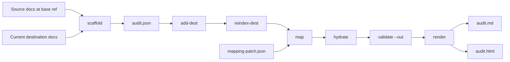

# Flow: docs-audit-v2 Skill and CLI

## Scope

This flow describes the implemented `active/docs-audit-v2` skill and TypeScript CLI. The skill is the agent-facing router. The CLI owns deterministic parsing, JSON mutation, validation, and render outputs.

## Surfaces

- `active/docs-audit-v2/SKILL.md`: short trigger guidance and command summary.
- `active/docs-audit-v2/references/schema.md`: canonical JSON schema and validation invariants.
- `active/docs-audit-v2/references/workflow.md`: operational audit sequence.
- `active/docs-audit-v2/references/refactor-integration.md`: contract for docs refactor skills that author mappings while rewriting docs.
- `active/docs-audit-v2/references/viewer.md`: Markdown report and HTML viewer behavior.
- `active/docs-audit-v2/scripts/src/parser.ts`: unified/remark Markdown and MDX block inventory.
- `active/docs-audit-v2/scripts/src/docs-audit-v2.ts`: CLI commands, audit mutations, validation, and renderers.
- `active/docs-audit-v2/assets/audit-viewer.html`: self-contained viewer template populated by `render`.
- `active/docs-audit-v2/scripts/tests/`: fixtures and Node test runner.

## Pipeline



## Command Behavior

`scaffold` reads explicit source and destination file lists. Source docs come from `--base` when provided; destinations always come from current files. It writes initial JSON with stable `S{n}`, `D{n}`, block, and line IDs.

`add-dest` appends new current destination docs to an existing audit. Existing destination IDs are preserved; new docs receive the next `D{n}` ID.

`reindex-dest` refreshes current destination inventories after doc edits. It preserves destination doc IDs and mapping destination-entry IDs. Existing destination entries are refreshed by exact unchanged text match; otherwise they receive `stale` metadata and validation treats them as blockers.

`map` merges authored mapping patches into the audit. It replaces mappings atomically by `id`, appends new mapping IDs, and runs structural validation before writing.

`hydrate` refreshes source inventories from source refs and updates changed-file metadata. It intentionally does not rewrite destination inventories or destination entries.

`validate` enforces material source-line coverage, required justifications, known IDs, destination range freshness, stale-entry blockers, generated/external destination requirements, and weak fallback rules. `validate --out` writes findings back into JSON for the renderer.

`render` produces a Markdown summary and/or self-contained HTML viewer from validated JSON. Render outputs are not canonical data.

## Parser Flow

`parser.ts` configures:

```ts
unified()
  .use(remarkParse)
  .use(remarkMdx)
  .use(remarkGfm)
  .use(remarkFrontmatter, ["yaml", "toml"]);
```

The parser uses top-level mdast node positions for block spans, then slices the original file text by physical line number. It never serializes mdast back to Markdown for audit text.

Node types normalize into audit block kinds:

- `yaml` and `toml`: `frontmatter`
- `heading`, `paragraph`, `list`, `table`, `code`, `blockquote`, `html`: same-scope block kinds
- `definition` and `footnoteDefinition`: `link-block`
- `thematicBreak`: `thematic-break`
- MDX ESM, expression, and JSX flow nodes: `mdx`

## Validation Flow

The validator builds ID indexes for source docs, destination docs, source blocks, source lines, destination blocks, destination lines, mappings, and destination entries.

For each mapping:

1. Validate required parent fields and enum values.
2. Enforce exactly one source block.
3. Validate each row references one source line in that source block.
4. Validate each destination entry by kind.
5. Validate current destination text still matches non-stale local/generated entries.
6. Apply line coverage rules.

After all mappings, validation scans every non-formatting source line. A material line with no row gets `unmapped-source-line`; a material line mapped by multiple rows gets an error.

## Viewer Flow

`render` embeds the audit JSON into `window.__AUDIT_DATA__`. The viewer builds:

- a source page selector from `sourceDocs[]`
- block-mode cards from `mappings[]`
- doc-mode lines from `sourceDocs[].blocks[].lines[]`
- source preview panes from selected mapping source block lines
- destination panes from line-level destination entries

Changed destination entries render as source-minus/destination-plus diff previews. Unchanged destination entries render as related references. Source lines whose row status is not `covered` or `intentionally-removed` are highlighted as uncovered.

## Packaging Flow

Proof uses the committed lockfile:

```bash
npm --prefix active/docs-audit-v2/scripts ci
npm --prefix active/docs-audit-v2/scripts run build
npm --prefix active/docs-audit-v2/scripts test
```

Before packaging, `active/docs-audit-v2/scripts/dist/docs-audit-v2.mjs` must exist. The build bundles runtime dependencies into that single `.mjs` file so an extracted package can run the CLI without `node_modules`. Before running `active/sc/scripts/package_skill.py`, remove `active/docs-audit-v2/scripts/node_modules` so the zip does not vendor dependencies. The generated `.skill` package is ignored by git.
